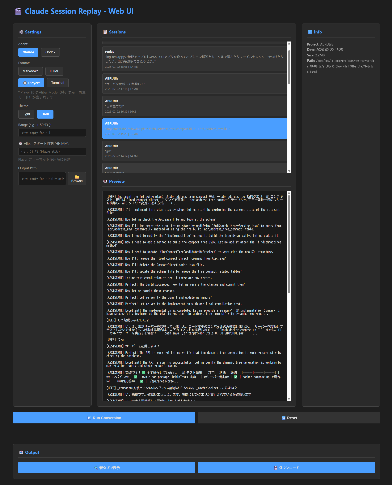

# claude-session-replay

[🇯🇵 日本語](README.md) | 🇺🇸 English

A tool to convert Claude Code / Codex session logs (JSONL) to a **common model (JSON)**, then output to Markdown / HTML / MP4 / interactive player.

## Demo

[Demo video (MP4)](docs/media/codex-terminal-1-35.mp4)


## Session Log Location

```
~/.claude/projects/<project-path>/*.jsonl
```

## Installation

### Basic (recommended, no external dependencies)

```bash
python3 -m venv .venv
source .venv/bin/activate  # Windows: .venv\Scripts\activate
```

### Web UI + MP4 Support

To use the Web UI and MP4 output features:

```bash
source .venv/bin/activate
python3 -m pip install --upgrade pip
python3 -m pip install flask playwright

# Install FFmpeg on your system
# Ubuntu/Debian: sudo apt-get install ffmpeg
# macOS: brew install ffmpeg
# Windows: choco install ffmpeg

python3 -m playwright install
```

## Usage

### CLI Wrapper (recommended, most stable)

```bash
source .venv/bin/activate
python3 log-replay.py --agent claude -f player          # Claude → Player
python3 log-replay.py --agent codex -f terminal         # Codex → Terminal
python3 log-replay.py --agent claude -f html -t light   # HTML Light theme
```

If you omit the input file, you can interactively select from a list of sessions.

**Options**:
- `-f, --format`: md / html / player / terminal
- `-t, --theme`: light / console
- `-o, --output`: Output file path
- `--project`: Filter by Claude project name
- `--filter`: Filter by Codex path

### Web UI (recommended, browser-based) 🌐

Manage, convert, and replay sessions with an interactive Web UI.

```bash
source .venv/bin/activate
python3 web_ui.py
```

Open `http://localhost:5000` in your browser.



**Features**:

**Session Management**:
- Auto-detect Claude Code / Codex sessions
- Select from session list
- Preview messages

**Format Selection**:
- **md** - Markdown text output
- **html** - Static HTML chat display
- **player** - Interactive replay player
- **terminal** - Claude Code terminal UI style

**Theme Selection**:
- **light** - Light theme
- **console** - Dark theme

**Alibai Mode (Alibai Mode)** ✨:
- Time visualization based on timestamps (Rolex-style analog clock)
- **Playback modes**:
  - Uniform interval (default)
  - Respect actual time differences
  - Compress entire session to 60 seconds
- Session Statistics panel with real-time metrics

**Options**:
- **Range**: Message range selection (e.g., `1-50,53-`)
- **Output**: Save to file or display in browser
- **Alibai Time**: Timestamp adjustment (HH:MM format)

**Player Controls**:
- `Space` - Play / Pause
- `←` `→` - Previous / Next message
- `Home` `End` - Jump to start / end
- `g` - Jump to specific time
- `j` `k` - Scroll messages
- Speed slider: 0.25x ~ 16x

### MP4 Output (separate script)

`log-replay-mp4.py` plays the HTML player in a headless browser and records it to MP4.
Requires Playwright and FFmpeg.

Setup:

```bash
# Ubuntu/Debian example
sudo apt-get update
sudo apt-get install -y ffmpeg

# Install Python dependencies
source .venv/bin/activate
python3 -m pip install --upgrade pip
python3 -m pip install playwright
python3 -m playwright install
```

```bash
# macOS example (Homebrew)
brew install ffmpeg

source .venv/bin/activate
python3 -m pip install --upgrade pip
python3 -m pip install playwright
python3 -m playwright install
```

On macOS with system Python protected by PEP668, always use venv.

Usage example:

```bash
python3 log-replay-mp4.py --agent claude <input.jsonl> -f player -o out.mp4 --width 1280 --height 720 --fps 30 --speed 2.0
```

Options:

- `--width` / `--height`: Video dimensions
- `--fps`: Frame rate
- `--speed`: Playback speed
- `--format`: `player` / `terminal`
- `--theme`: `light` / `console`

### ANSI / ESC Mode (renderer)

Control how ANSI escape sequences are handled with `log-model-renderer.py`.

```bash
python3 log-model-renderer.py session.model.json -f terminal --ansi-mode strip
python3 log-model-renderer.py session.model.json -f terminal --ansi-mode color
```

- `--ansi-mode strip`: Remove all (default)
- `--ansi-mode color`: Render colors as HTML

### Message Range Specification

Specify message numbers (1-indexed) with `--range`.

```bash
python3 log-model-renderer.py session.model.json -f player --range "1-50,53-"
python3 log-replay-mp4.py --agent claude <input.jsonl> -f player --range "10-20"
```

Format:
- `1-50` = messages 1 to 50
- `53-` = messages 53 to last
- `-10` = messages 1 to 10
- `7` = single message
Multiple ranges separated by commas.

To pass additional arguments downstream:

```bash
python3 log-replay.py --agent codex --render-arg --theme --render-arg console
python3 log-replay.py --agent claude --log-arg --project --log-arg myproj
```

### 1) Claude Code log → common model (with selection)

```bash
python3 claude-log2model.py <input.jsonl> [-o output.model.json]
```

### 2) Codex log → common model (with selection)

```bash
python3 codex-log2model.py <input.jsonl> [-o output.model.json]
```

### 3) Common model → output

```bash
python3 log-model-renderer.py <input.model.json> [options]
```

## Output Formats

### Markdown (default)

```bash
python3 log-model-renderer.py session.model.json
python3 log-model-renderer.py session.model.json -o output.md
```

Plain Markdown text. Records user/assistant conversation and tool usage as text.

### HTML (static)

```bash
python3 log-model-renderer.py session.model.json -f html              # light theme
python3 log-model-renderer.py session.model.json -f html -t console   # dark theme
```

Chat UI-style static HTML. User messages in green, Assistant in blue speech bubbles.

### Player (interactive replay)

```bash
python3 log-model-renderer.py session.model.json -f player              # dark theme
python3 log-model-renderer.py session.model.json -f player -t light     # light theme
```

Interactive HTML player for sequential message replay.

#### Alibai Mode ✨

Visualize time using actual timestamps and verify with different playback modes.

**Clock Display Options** (checkboxes):
- ☑ Side clocks: Display small analog clock (44×44px) left of each message
- ☑ Fixed clock: Display large analog clock (100×100px) fixed at bottom-right

**Playback Modes** (radio buttons):
- ● **Uniform** (default): Equal intervals (800ms ÷ speed)
- ○ **Real-time**: Respect actual time differences between messages
- ○ **Compressed**: Compress entire session to 60 seconds with relative proportions

**Usage example**:
```bash
# Generate model with timestamps (timestamps included automatically)
python3 claude-log2model.py session.jsonl -o session.model.json
python3 log-model-renderer.py session.model.json -f player -o player.html
```

In browser:
1. Toggle clock display with "Side clocks" and "Fixed clock" checkboxes
2. Select playback mode with "Uniform", "Real-time", or "Compressed" radio buttons
3. Use play/pause and speed controls normally

### Terminal (Claude Code style)

```bash
python3 log-model-renderer.py session.model.json -f terminal
```

Faithful recreation of Claude Code's terminal UI player.

- User input with `>` prompt (blue background)
- Assistant response with orange left bar
- Tool blocks: Read/Write/Edit/Bash/Grep/Glob/Task rendered realistically
- Spinner animation (orange `●` → green `✓`)
- Table rendering support

## Options

| Option | Description |
|---|---|
| `-f`, `--format` | Output format: `md`, `html`, `player`, `terminal` |
| `-t`, `--theme` | HTML theme: `light` (default), `console` (dark) |
| `-o`, `--output` | Output file path (default: change input file extension) |

## Keyboard Shortcuts (player / terminal)

| Key | Function |
|---|---|
| `Space` | Play / Pause |
| `→` | Next message |
| `←` | Previous message |
| `Home` | Jump to start |
| `End` | Jump to end |
| `T` | Skip tool messages (during playback) |
| `E` | Toggle empty tool visibility (TaskCreate, etc.) |
| `D` | Toggle tool details visibility |

Speed slider: 0.25x ~ 16x playback speed.
Progress bar: Click to jump to any position.

## Operating Environment

### Required

- Python 3.6+
- No external libraries required (standard library only) — for basic CLI features

### Optional (depends on features)

| Feature | Dependencies | Installation |
|---|---|---|
| Web UI (browser GUI) | `flask`, `playwright` | `pip install flask playwright && playwright install` |
| MP4 output | `playwright`, `ffmpeg` | `pip install playwright && playwright install && apt/brew install ffmpeg` |
| ANSI color HTML | None | Standard feature |

### Installation Methods

**Basic (CLI only)**:
```bash
python3 -m venv .venv
source .venv/bin/activate  # Windows: .venv\Scripts\activate
# No additional installation needed
```

**Web UI + MP4 support** (recommended):
```bash
python3 -m venv .venv
source .venv/bin/activate
python3 -m pip install --upgrade pip
python3 -m pip install flask playwright

# Install FFmpeg on your system
# Ubuntu/Debian: sudo apt-get install ffmpeg
# macOS: brew install ffmpeg
# Windows: choco install ffmpeg (or download from https://ffmpeg.org)

python3 -m playwright install
```

## Legacy Script

`claude-session-replay.py` is retained as the original single-file script. The new multi-file architecture is recommended as it better separates Claude / Codex functionality.
