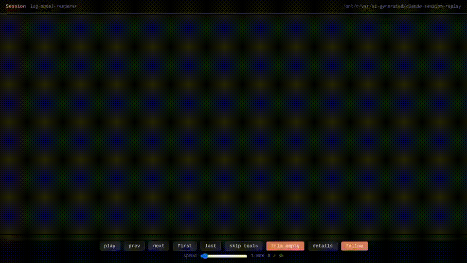

# claude-session-replay

Claude Code / Codex のセッションログ (JSONL) を **共通モデル(JSON)** に変換し、Markdown / HTML / MP4 / インタラクティブプレイヤーに出力するツール。

## Demo

[Demo video (MP4)](docs/media/codex-terminal-1-35.mp4)



## セッションログの場所

```
~/.claude/projects/<プロジェクトパス>/*.jsonl
```

## インストール

### 基本 (推奨・外部依存なし)

```bash
python3 -m venv .venv
source .venv/bin/activate  # Windows: .venv\Scripts\activate
```

### TUI有効化 (Textual 使用)

TUI モードを使う場合は `textual` をインストール:

```bash
source .venv/bin/activate
python3 -m pip install --upgrade pip
python3 -m pip install textual
```

## 使い方 (新構成)

### ラッパー (推奨)

```bash
python3 log-replay.py --agent claude <input.jsonl> -f player
python3 log-replay.py --agent codex <input.jsonl> -f terminal
```

入力ファイルを省略すると、各エージェント用の一覧から選択できます。

### TUI モード (対話型 GUI)

```bash
# 簡単: 専用ランチャーを使用 (推奨)
./tui

# または venv を有効化してから実行
source .venv/bin/activate
python3 log_replay_tui.py

# または venv 内の Python を直接使用
.venv/bin/python3 log_replay_tui.py
```

TUIを使用すると以下の操作がGUI上でできます:

**セッション選択**:
- Agent を選択 (Claude / Codex)
- セッションリストから対象を選択
- 右パネルにプレビュー表示

**オプション設定**:
- **Format**: md / html / player / terminal
- **Theme**: light / console (HTML系フォーマットに適用)
- **Range**: メッセージ範囲指定 (例: `1-50,53-`)
- **Output**: 出力ファイルパス (空白で stdout)

**実行**:
- Run ボタンで変換・レンダリング実行
- 完了時に通知表示

**キー操作**:
- `q`: 終了

### MP4 出力 (別スクリプト)

`log-replay-mp4.py` は HTML プレイヤーをヘッドレスブラウザで再生し、録画して MP4 にします。
Playwright と FFmpeg が必要です。

セットアップ:

```bash
# Ubuntu/Debian 例
sudo apt-get update
sudo apt-get install -y ffmpeg

# Python 依存をインストール
source .venv/bin/activate
python3 -m pip install --upgrade pip
python3 -m pip install playwright
python3 -m playwright install
```

```bash
# macOS 例 (Homebrew)
brew install ffmpeg

source .venv/bin/activate
python3 -m pip install --upgrade pip
python3 -m pip install playwright
python3 -m playwright install
```

macOS でシステム Python が PEP668 で保護されている場合は、必ず venv を使用してください。

使用例:

```bash
python3 log-replay-mp4.py --agent claude <input.jsonl> -f player -o out.mp4 --width 1280 --height 720 --fps 30 --speed 2.0
```

オプション:

- `--width` / `--height`: 動画サイズ
- `--fps`: フレームレート
- `--speed`: 再生速度
- `--format`: `player` / `terminal`
- `--theme`: `light` / `console`

### ANSI / ESC 対応モード (renderer)

`log-model-renderer.py` で ANSI エスケープをどう扱うかを選べます。

```bash
python3 log-model-renderer.py session.model.json -f terminal --ansi-mode strip
python3 log-model-renderer.py session.model.json -f terminal --ansi-mode color
```

- `--ansi-mode strip`: すべて削除（デフォルト）
- `--ansi-mode color`: 色だけ反映（HTMLとして描画）

### メッセージ範囲指定

`--range` でメッセージ番号（1始まり）を指定できます。

```bash
python3 log-model-renderer.py session.model.json -f player --range "1-50,53-"
python3 log-replay-mp4.py --agent claude <input.jsonl> -f player --range "10-20"
```

形式:
- `1-50` = 1〜50
- `53-` = 53〜最後
- `-10` = 1〜10
- `7` = 単一
複数はカンマ区切り。

追加の引数を下流に渡す場合:

```bash
python3 log-replay.py --agent codex --render-arg --theme --render-arg console
python3 log-replay.py --agent claude --log-arg --project --log-arg myproj
```

### 1) Claude Code ログ → 共通モデル (一覧選択あり)

```bash
python3 claude-log2model.py <input.jsonl> [-o output.model.json]
```

### 2) Codex ログ → 共通モデル (一覧選択あり)

```bash
python3 codex-log2model.py <input.jsonl> [-o output.model.json]
```

### 3) 共通モデル → 出力

```bash
python3 log-model-renderer.py <input.model.json> [options]
```

## 出力フォーマット

### Markdown (デフォルト)

```bash
python3 log-model-renderer.py session.model.json
python3 log-model-renderer.py session.model.json -o output.md
```

プレーンなMarkdownテキスト。User/Assistant の会話とツール使用をテキストで記録。

### HTML (静的)

```bash
python3 log-model-renderer.py session.model.json -f html              # light テーマ
python3 log-model-renderer.py session.model.json -f html -t console   # dark テーマ
```

チャットUI風の静的HTML。User は緑、Assistant は青の吹き出し表示。

### Player (再生プレイヤー)

```bash
python3 log-model-renderer.py session.model.json -f player              # dark テーマ
python3 log-model-renderer.py session.model.json -f player -t light     # light テーマ
```

メッセージを順番に再生できるインタラクティブHTMLプレイヤー。

#### アリバイモード (Alibai Mode) ✨

実際のタイムスタンプを使用して時間を可視化し、異なる再生モードで検証できます。

**時計表示オプション** (チェックボックス):
- ☑ Side clocks: 各メッセージの左に小型アナログ時計（44×44px）を表示
- ☑ Fixed clock: 画面右下に大型アナログ時計（100×100px）を固定表示

**再生モード** (ラジオボタン):
- ● **Uniform** (デフォルト): 均一間隔（800ms ÷ speed）
- ○ **Real-time**: メッセージ間の実際の時間差を尊重して再生
- ○ **Compressed**: セッション全体を60秒に圧縮して相対比率で再生

**使用例**:
```bash
# タイムスタンプ付きでモデル生成（自動的にタイムスタンプが含まれます）
python3 claude-log2model.py session.jsonl -o session.model.json
python3 log-model-renderer.py session.model.json -f player -o player.html
```

ブラウザで開いて:
1. 「Side clocks」「Fixed clock」のチェックボックスで時計表示を切り替え
2. 「Uniform」「Real-time」「Compressed」ラジオボタンで再生モードを選択
3. 通常の play/pause と speed コントロールで再生

### Terminal (Claude Code 風)

```bash
python3 log-model-renderer.py session.model.json -f terminal
```

Claude Code のターミナルUIを忠実に再現したプレイヤー。

- `>` プロンプト付きのユーザー入力 (青背景)
- オレンジの左バー付き Assistant レスポンス
- ツールブロック: Read/Write/Edit/Bash/Grep/Glob/Task をリアルに表示
- スピナーアニメーション (orange `●` → green `✓`)
- テーブルのレンダリング対応

## オプション

| オプション | 説明 |
|---|---|
| `-f`, `--format` | 出力形式: `md`, `html`, `player`, `terminal` |
| `-t`, `--theme` | HTMLテーマ: `light` (デフォルト), `console` (dark) |
| `-o`, `--output` | 出力ファイルパス (省略時は入力ファイルの拡張子を変更) |

## キーボードショートカット (player / terminal)

| キー | 機能 |
|---|---|
| `Space` | 再生 / 一時停止 |
| `→` | 次のメッセージ |
| `←` | 前のメッセージ |
| `Home` | 最初に戻る |
| `End` | 最後まで表示 |
| `T` | ツールメッセージをスキップ (再生時) |
| `E` | 空ツールの表示/非表示 (TaskCreate等) |
| `D` | ツール詳細の表示/非表示 |

速度スライダーで 0.25x ~ 16x の再生速度に対応。
プログレスバーのクリックで任意の位置にジャンプ可能。

## 動作環境

### 必須
- Python 3.6+
- 外部ライブラリ不要 (標準ライブラリのみ) — 基本的な CLI 機能

### オプション (機能に応じて)

| 機能 | 依存パッケージ | インストール |
|---|---|---|
| TUI モード (対話型 GUI) | `textual` | `pip install textual` |
| MP4 出力 | `playwright`, `ffmpeg` | `pip install playwright && playwright install && apt/brew install ffmpeg` |
| ANSI カラー HTML | なし | 標準機能 |

### インストール方法

**基本のみ**:
```bash
python3 -m venv .venv
source .venv/bin/activate  # Windows: .venv\Scripts\activate
# 追加インストール不要
```

**TUI + MP4 対応**:
```bash
python3 -m venv .venv
source .venv/bin/activate
python3 -m pip install --upgrade pip
python3 -m pip install textual playwright

# FFmpeg をシステムにインストール
# Ubuntu/Debian: sudo apt-get install ffmpeg
# macOS: brew install ffmpeg
# Windows: choco install ffmpeg (または https://ffmpeg.org から DL)

python3 -m playwright install
```

## 旧スクリプト

`claude-session-replay.py` は従来の単体スクリプトとして残しています。新構成のほうが Claude / Codex を分離できるため推奨です。
