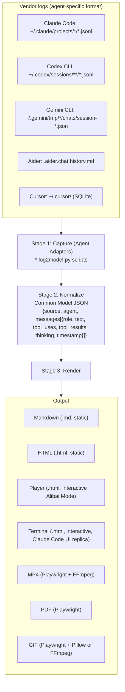
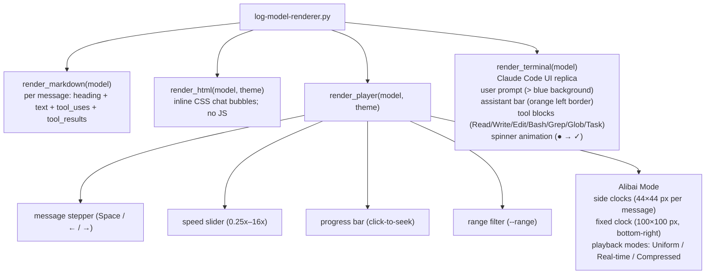

[日本語版](architecture-ja.md)

# Architecture

claude-session-replay uses a **three-stage pipeline** to decouple agent-specific log parsing from output rendering.

---

## Table of Contents

- [Overview](#overview)
- [Stage 1 — Capture (Agent Adapters)](#stage-1--capture-agent-adapters)
- [Stage 2 — Normalize (Common Model)](#stage-2--normalize-common-model)
- [Stage 3 — Render](#stage-3--render)
- [Entry Points](#entry-points)
- [Renderer Tree](#renderer-tree)
- [Dependency Model](#dependency-model)
- [File Layout](#file-layout)

---

## Overview



---

## Stage 1 — Capture (Agent Adapters)

Each adapter is an independent Python script that follows the same logical interface:

```python
def parse_messages(input_path: str) -> list[dict]
    """Read the log file; return raw message records."""

def build_model(messages: list[dict], input_path: str) -> dict
    """Transform raw messages into the common model dict."""

def discover_sessions(filter: str = None) -> list[dict]
    """Scan known filesystem locations; return session metadata list."""

def select_session(sessions: list[dict]) -> str
    """Interactive picker; return chosen file path."""
```

The contract is a convention, not an abstract base class.

### Adapter scripts

| Script | Agent | Input format |
|--------|-------|-------------|
| `claude-log2model.py` | Claude Code | JSONL, one record per line |
| `codex-log2model.py` | OpenAI Codex CLI | JSONL |
| `gemini-log2model.py` | Gemini CLI | JSON array |
| `aider-log2model.py` | Aider | Markdown (`.aider.chat.history.md`) |
| `cursor-log2model.py` | Cursor | SQLite databases |

See [agents.md](agents.md) for per-adapter log format details.

### Adding a new agent

1. Create `<agent>-log2model.py` implementing the four-function contract.
2. Register `--agent <name>` in `log-replay.py`.
3. Register in `web_ui.py` (import + session discovery).
4. No changes needed in the renderer.

---

## Stage 2 — Normalize (Common Model)

All adapters output the same JSON structure. Full schema in [data-model.md](data-model.md).

**Invariants**:
- `role` is always `"user"` or `"assistant"` regardless of source agent terminology.
- `timestamp` is ISO 8601, or empty string when unavailable.
- `source` is a basename — never an absolute path.
- Messages are in original chronological order.
- A message is included only when at least one of `text`, `tool_uses`, `tool_results`, or `thinking` is non-empty.

The common model is **agent-agnostic**. Any renderer consumes any model.

---

## Stage 3 — Render

`log-model-renderer.py` reads the common model and produces output. Format selected via `-f`.

| Format | Output type | Dependencies |
|--------|------------|-------------|
| `md` | Plain text | None |
| `html` | Static HTML | None |
| `player` | Self-contained HTML + JS | Browser |
| `terminal` | Self-contained HTML + JS | Browser |

Video/image renderers are separate scripts that render to HTML then drive a headless browser:

| Script | Renderer used | Output |
|--------|--------------|--------|
| `log-replay-mp4.py` | `player` or `terminal` | MP4 |
| `log-replay-pdf.py` | `html` or `player` | PDF |
| `log-replay-gif.py` | `player` or `terminal` | GIF |

---

## Entry Points

| Script | Role |
|--------|------|
| `log-replay.py` | CLI wrapper — selects adapter, pipes to renderer |
| `web_ui.py` | Flask browser UI — session management + live conversion |
| `log-model-renderer.py` | Direct renderer — reads common model, writes output |
| `session-shipper.py` | Enterprise — ships sessions to OpenSearch (batch/watch) |
| `session-stats.py` | Statistics reporter |

---

## Renderer Tree



---

## Dependency Model

| Category | Scripts | Dependencies |
|---|---|---|
| Core (no external dependencies — Python 3.9+ stdlib only) | `claude-log2model.py`, `codex-log2model.py`, `gemini-log2model.py`, `aider-log2model.py`, `cursor-log2model.py`, `log-model-renderer.py`, `log-replay.py` | (none) |
| Optional — Web UI | `web_ui.py` | flask |
| Optional — Headless recording (MP4) | `log-replay-mp4.py` | playwright, ffmpeg (system binary) |
| Optional — Headless recording (PDF) | `log-replay-pdf.py` | playwright |
| Optional — Headless recording (GIF) | `log-replay-gif.py` | playwright, pillow (or ffmpeg) |

> **Note**: `pyproject.toml` is present. Install optional dependencies with the `web`, `export`, or `all` extras in a venv (for example, `pip install -e ".[all]"`).

Lazy imports ensure missing optional packages only cause errors at the feature boundary, not at startup.

---

## File Layout

```
claude-session-replay/
├── log-replay.py              # CLI wrapper (pipeline orchestrator)
├── log_replay.py              # Import shim for `pip install -e .` entry point
├── claude-log2model.py        # Capture: Claude Code
├── codex-log2model.py         # Capture: Codex CLI
├── gemini-log2model.py        # Capture: Gemini CLI
├── aider-log2model.py         # Capture: Aider
├── cursor-log2model.py        # Capture: Cursor
├── log-model-renderer.py      # Render: md/html/player/terminal
├── log-replay-mp4.py          # Render: MP4 (Playwright + FFmpeg)
├── log-replay-pdf.py          # Render: PDF (Playwright)
├── log-replay-gif.py          # Render: GIF (Playwright + Pillow/FFmpeg)
├── log-replay-stream.py       # Live stream/follow a session in real time
├── log_replay_tui.py          # Textual TUI (optional dep: textual)
├── web_ui.py                  # Flask Web UI (optional dep: flask)
├── session-shipper.py         # Enterprise session shipper
├── session-stats.py          # Session statistics & diff
├── search_utils.py            # Shared session discovery helpers
├── claude-session-replay.py   # Legacy single-file script (retained, deprecated)
├── run-web.sh                 # Web UI startup script
├── tui                        # TUI startup script
├── templates/
│   └── index.html             # Web UI template
├── spec/
│   └── SPEC.md                # Full specification (12-section)
├── tests/
│   ├── conftest.py
│   ├── test_claude_adapter.py
│   ├── test_renderer.py
│   ├── test_search_utils.py
│   └── fixtures/
│       └── claude_session.jsonl
├── docs/
│   ├── architecture.md        # This document
│   ├── architecture-ja.md     # 日本語版
│   ├── getting-started.md
│   ├── getting-started-ja.md
│   ├── agents.md
│   ├── agents-ja.md
│   ├── renderers.md
│   ├── renderers-ja.md
│   ├── data-model.md          # Common model schema
│   ├── output-formats.md      # Output format specifications
│   ├── agent-adapters.md      # Agent adapter specifications
│   ├── backlog.md
│   ├── vision.md
│   ├── enterprise-deployment-guide.md
│   ├── spec-enterprise-shipping.md
│   ├── plan-session-shipper.md
│   ├── market/
│   └── media/                 # Demo videos and screenshots
├── pyproject.toml             # Build & optional extras (flask/playwright/...)
├── STRUCTURE.md               # Repository structure policy
├── shipper-config.example.json
├── README.md                  # Japanese README
├── README.en.md               # English README
├── CLAUDE.md                  # AI development guide
└── CHANGELOG.md
```
