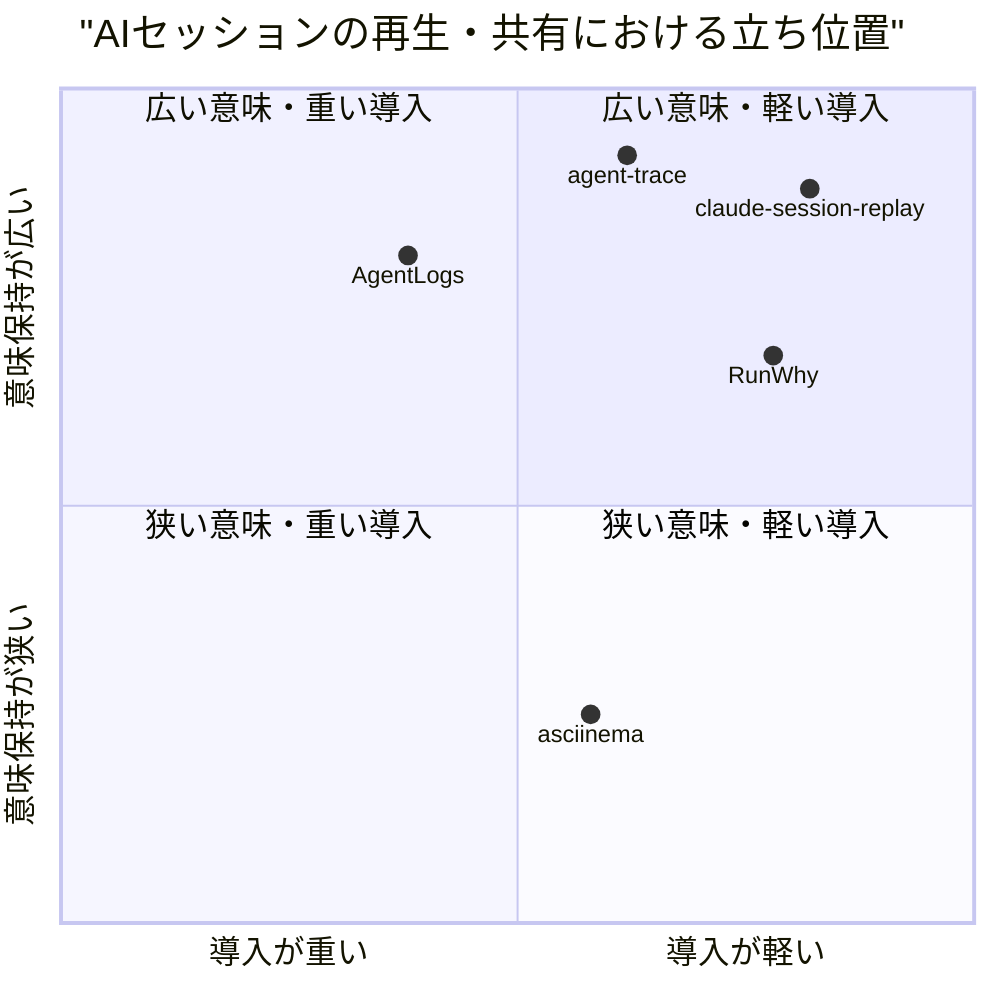
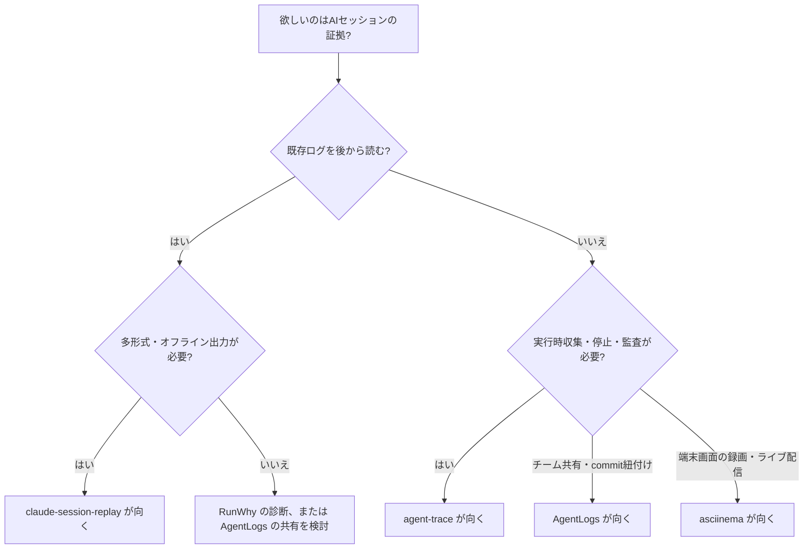

# 市場調査: claude-session-replay

## 0. 要約

立ち位置: 複数エージェントの既存ログを、依存の軽い共通モデルから7形式へ変換してローカルで再生できる点が強い。

最大の弱点: 録画時のフック、チーム共有、秘密情報の自動除去、Gitコミットとの紐付けがなく、後発の専用ツールに「見る前の収集」と「共有後の運用」で負ける。

次の一手: 共通モデルを壊さず、まず安全な共有用パッケージ（赤字化・メタデータ・静的URL/zip）を作り、その後に収集フックを追加する。

## 1. このrepoは何か

一言でいうと、Claude Code / Codex CLI / Gemini CLI / Aider / Cursor のセッションログを共通JSONモデルへ正規化し、Markdown、静的HTML、インタラクティブPlayer、Terminal風Player、MP4、PDF、GIFへ変換するローカルOSSツールである。READMEだけでなく、`docs/architecture.md`、`docs/data-model.md`、各アダプターと `web_ui.py` を確認した。

価値の単位はrepo単体のパーサではない。利用者のローカルに既にあるエージェントログを、アダプター → 共通モデル → レンダラーという3段パイプラインで「人がレビューできる証跡・教材・動画」に変える一連の作業である。したがって比較対象は、同じくセッションの収集・理解・再生・共有までを担う製品、および再生・共有の標準的な隣接製品とした。

想定利用者は、AIコーディングの作業過程を自分で振り返る開発者、チームにデモや証跡を渡す開発者、エージェントの出力を教育・レビュー用動画にしたい人である。Web UIはFlaskのローカルサーバとして動き、セッション一覧、変換、検索、統計、差分、編集、zip/PDF出力、ストリーム表示のAPIを持つ。

確認できた客観指標は、Python 21ファイル・13,472行、テスト3ファイル・80テスト、`pytest -q` の80 passed（2026-07-31）、通常のプロジェクト依存0、Web UI APIルート17、MITライセンスである。`pyproject.toml` にはCLIエントリポイントと `web` / `export` / `dev` オプション依存が定義されている。なお `docs/architecture.md` の「pyproject.tomlはない」という記述は現状とずれている。

## 1.5 調査の型

`target_type: hybrid` とした。厳密なSaaSではなく、ローカルCLI・共通変換ライブラリ・Flask Web UI・ヘッドレス書き出しを同じrepoで提供するOSSの複合型である。比較の主軸は、機能の網羅性だけでなく、入力（既存ログか録画フックか）、共通モデル、再生・検索・差分、共有・チーム運用、依存と導入の重さ、安全性である。

コードを読める自repoとOSS比較対象については、公開リポジトリのREADME、ツリー、設定ファイル、テスト配置、ライセンスを実際に確認した。比較対象を実行した結果ではないため、実行性能・UI品質・未記載の機能は断定しない。

## 2. 比較対象と選定理由

| 製品 | 何ができるか | 採用状況（2026-07-31参照） | ライセンス | うちとの決定的な違い | なぜ比較対象に選んだか |
|---|---|---:|---|---|---|
| AgentLogs | 複数エージェントのトランスクリプト収集、チーム観測、プロンプト共有、Gitコミット紐付け、self-host/cloud | ★200 / GitHubの最終コミット日は画面上で確認できず / 628 commits | FSL-1.1-Apache-2.0 | 録画フックとチーム・コミット単位の運用が中心。自repoは既存ファイルを後処理し、多形式出力が中心 | 同じAIコーディングセッションを対象に、収集からチーム共有までを一つの製品にしている直接競合 |
| agent-trace | Claude/Codex/Gemini/Cursor/Copilot等のフック、MCPプロキシ、Pythonデコレーターで記録し、端末/HTML再生、diff、原因説明、監査、kill switch | ★82 / 最終コミット日は画面上で確認できず / 176 commits | MIT | 入力を実行時に捕捉し、監査・停止・因果分析まで扱う。自repoは静的ログの表現力と対応形式が広い | ローカルファーストで「何をしたか」を再生するOSSで、共通モデルと安全運用の比較に適する |
| RunWhy | Claude/Codexのローカルログを読み、再生、recap、所要時間・停滞原因の診断、共有可能な証拠を生成 | ★1 / 最終コミット日は画面上で確認できず / 24 commits | MIT | 原因診断と証拠へのジャンプに特化。自repoは診断よりアダプター数・出力形式・編集/統計の幅を優先 | 同じ「raw JSONLを読む」問題を、より狭い問い（なぜ遅いか）で解いている新しい隣接競合 |
| asciinema | 端末セッションの録画、軽量cast保存、端末/Web再生、ライブ配信、共有、マーカー、圧縮 | ★17.6k / v3.2.0 released 2026-03-01 | GPL-3.0-or-later | 端末の見た目を録画時点で保存し、ライブ共有できる。自repoはエージェント固有の意味（tool use、thinking、timestamp）を保持し後処理する | セッション再生・軽量保存・Web共有の成熟した基準。AIログ特化機能との差分を測れる |

この市場は、巨大な汎用LLM observability製品よりも、AIコーディング作業の「セッション」を可視化する小規模OSSが急速に増えている。AgentLogsはチーム運用、agent-traceは実行時の監査、RunWhyは診断、asciinemaは端末再生というように、勝負は単一の再生UIではなく、入力をどう確保し、見た後に何を判断・共有できるかへ移っていると読める。自repoはこの中で、既存ログを壊さず5エージェント・7出力へ変換する中立層にいる。

## 3. ポジショニング

比較できる数値が揃ったため、横軸を「既存ログからの導入の軽さ」、縦軸を「エージェント固有の意味を保持する広さ」とした。自repoとagent-trace/RunWhyはローカル入力、AgentLogsはプラグイン・サーバ運用、asciinemaは録画開始が必要という公開手順に基づく相対配置であり、定量ベンチマークではない。

## 4. 機能比較

| 機能 | 重み | うち | AgentLogs | agent-trace | RunWhy | asciinema |
|---|---|---|---|---|---|---|
| 既存ログを後から読み込む | ◎必須 | ○ | △ | ○ | ○ | × |
| 5種類以上のエージェント対応 | ◎必須 | ○ | △（5種） | ○（README記載のフック/MCP） | ×（Claude/Codex） | × |
| エージェント非依存の共通モデル | ◎必須 | ○ | ○（shared types/schemas） | △（イベント中心） | △（実装詳細は未確認） | × |
| tool use / result / thinking の保持 | ◎必須 | ○ | ○ | ○ | ○ | × |
| インタラクティブ再生 | ◎必須 | ○ | ○ | ○ | ○ | ○（端末/Web） |
| Markdown / HTML / terminal出力 | ○効く | ○ | △ | ○ | ○ | △（cast） |
| MP4 / PDF / GIF書き出し | ○効く | ○ | ×（公開説明で確認できず） | ×（公開説明で確認できず） | ×（公開説明で確認できず） | △（録画共有はできるが同一機能ではない） |
| セッション内・横断検索、統計、diff | ○効く | ○ | ○（dashboard） | ○（diff/timeline/compare） | △（diagnosis中心） | × |
| 実行時フック・ライブ収集 | ◎必須 | × | ○ | ○ | × | ○（端末録画） |
| Gitコミットとの紐付け | ○効く | × | ○ | △（公開説明で明記なし） | △（公開例はあるが範囲不明） | × |
| チーム共有・権限 | ○効く | × | ○ | △（RBAC記載あり） | × | ○（公開/埋め込み共有） |
| ローカル・依存最小でオフライン閲覧 | ◎必須 | ○ | △（サーバ、認証、Bun等） | ○（標準ライブラリ、zero dependencies） | ○（local-first、no telemetry） | ○ |
| 秘密情報の検出・赤字化 | ◎必須 | × | ○（1,600+パターンの説明） | △（公開説明で確認できず） | ○（共有前 redaction の説明） | × |

この表で痛い×は、収集フック、Gitとの関係、秘密情報の扱い、チーム共有である。これらは再生UIの見た目より、セッションを実務の証拠として安全に渡せるかを決める。一方、MP4/PDF/GIFの○は明確な差別化だが、利用頻度が常に高いとは限らず、収集と安全性を後回しにしてまで拡張すべきではない。AgentLogsやagent-traceの共有・監査機能は、公開説明に基づくため、実際の導入時の完成度は未確認である。

## 4.5 コード・実装の比較

| 観点 | うち | AgentLogs | agent-trace | RunWhy | asciinema | 出典 |
|---|---:|---:|---:|---:|---:|---|
| 主実装 | Python | TypeScript/Bun | Python | TypeScript/Node | Rust | 各リポジトリの構成 |
| 通常の必須依存 | 0 | Bun + workspace依存 | 0（README記載） | Node.js >=18 | Rust/Cargo | `pyproject.toml`、各README/設定 |
| テストの公開単位 | 3 files / 80 tests、80 passed | e2e package、実行コマンドあり（件数未確認） | tests dir、unittest実行コマンドあり（件数未確認） | test dir（件数未確認） | tests dir（件数未確認） | ソースツリーとREADME |
| API/拡張単位 | 5 adapter + 1共通model + 7 renderer | CLI + server + shared + agent plugins | CLI hooks + MCP proxy + decorators | CLI + local Web UI | CLI + asciicast format/player/server | ソースツリー、README、docs |
| ライセンス制約 | MIT | FSL-1.1-Apache-2.0 | MIT | MIT | GPL-3.0-or-later | LICENSE / package設定 |
| 配布方式 | `pyproject` CLI、ソース、任意依存 | Docker / standalone binary / cloud | pip/uv、Python標準ライブラリ | npm | cargo / binary | 各README |

自repoは、コア依存0と80件のローカルテストを持ち、変換だけなら導入が軽い。一方、機能を単一の大きなPythonファイル群と慣例的なアダプター契約に置いているため、AgentLogsのshared schemaやagent-traceのフック・プロキシのような外部拡張面はまだ明文化されていない。asciinemaはRust/CargoとGPLという重さがある代わりに、録画フォーマットとストリーミングを長期運用する設計に寄せている。比較対象のテスト件数・配布バイナリサイズは公開ページで揃わなかったため、推測で埋めていない。

## 5.5 調査者の見立て

本当の勝負所は、7形式あることではなく「既存ログを失わず、エージェントをまたいで、同じ共通モデルからレビュー可能な成果物を作れること」だと思う。ここはAgentLogsの運用基盤やasciinemaの録画成熟度とは別の、移行コストが低い中立層として残っている。

数字に出ていない懸念は、対応ログ形式の変化に対する保守コストと、thinking・tool result・編集済みセッションを共有するときの秘匿性である。現状は実装量が大きく、アダプター契約が抽象基底クラスではなく慣例なので、5個目以降の対応が品質を揺らす可能性がある（推測）。

自分なら、次は新しいレンダラーを増やさず、共通モデルをバージョン付きschemaとして固定し、redaction付きの静的共有パッケージとGitメタデータを追加する。これなら現在の「ローカル・多形式・オフライン」という軸を守ったまま、AgentLogs/RunWhyが強い運用側へ橋をかけられる。

この見立てが外れる条件は、利用者の大半が「録画開始から共有URLまで」を求め、既存ログの後処理を求めていないこと、またはAgentLogsがMIT相当の条件でオフライン多形式出力まで提供することである。その場合、自repoの中立変換層は差別化にならず、収集・共有製品へ寄せるか撤退する判断が必要になる。

## 6. 提案（優先順）

| 順 | 提案 | 分類 | 根拠 | 最小の一手 | 効きそうな指標 |
|---:|---|---|---|---|---|
| 1 | 共通モデルをschema/version付きの公開契約にする | 伸ばす | 5アダプターと全レンダラーをつなぐ中心資産。4節の必須機能 | `schema_version`、nullable拡張、fixture、互換性テストを追加 | 新アダプター追加時の既存テスト破壊数、外部利用例 |
| 2 | 共有前のsecret redactionと安全な静的bundleを追加する | 埋める | AgentLogs/RunWhyとの差が大きく、証跡用途の必須要件 | tool args/results/thinkingを対象に、置換ルールとdry-run CLIを作る | redaction検出率、誤検出率、共有bundle生成時間 |
| 3 | Git branch/commit、ファイル変更のメタデータを共通モデルに任意追加する | 埋める | AgentLogsの決定的な差。レビュー用途で再生と成果物を結びつける | 入力ログの隣のGit情報を読み、出力HTML/Markdownに表示 | commit紐付け率、レビュー時の再現時間 |
| 4 | 収集フックを最小仕様で追加し、既存ログの後処理と同じモデルへ入れる | 伸ばす | 現在の最大の×。agent-trace/AgentLogsはここで先行 | まずClaude Code/Codexの終了時フックだけ、失敗しても本体を止めない | capture成功率、対応エージェント数、フックの追加時間 |
| 5 | チーム常設サーバ、RBAC、LLM要約を本体の次の目標にしない | やらない | AgentLogs/Langfuse系との正面衝突で、依存・運用・秘密管理が急増し、現状のローカル優位を薄める | READMEで「local-first変換・共有bundle」を明記し、サーバは連携点に留める | コア依存数、初回表示までの時間、自己ホスト手順数 |

## 7. 選択の分岐

## 8. 出典

| URL | 参照日 | 何の根拠に使ったか |
|---|---|---|
| `README.md`（自repo） | 2026-07-31 | 目的、対応エージェント、出力形式、CLI/Web UI |
| `docs/architecture.md`、`docs/data-model.md`、`docs/agents.md`、`docs/renderers.md`（自repo） | 2026-07-31 | 3段パイプライン、共通モデル、対応範囲、レンダラー仕様 |
| `pyproject.toml`、`web_ui.py`、`tests/`（自repo） | 2026-07-31 | 依存、CLI、APIルート、80テスト、ライセンス、実行結果 |
| https://github.com/agentlogs/agentlogs | 2026-07-31 | 機能、対応エージェント、★200、628 commits、構成、FSLライセンス |
| https://agentlogs.ai/ | 2026-07-31 | self-host/cloud、秘密情報1,600+パターン、可視性、機能説明 |
| https://github.com/agentlogs/agentlogs/blob/main/package.json | 2026-07-31 | Bun workspace、e2e、依存、FSL-1.1-Apache-2.0 |
| https://github.com/Siddhant-K-code/agent-trace | 2026-07-31 | フック、MCP proxy、再生/diff/audit、★82、MIT、176 commits、テスト実行方法 |
| https://github.com/Siddhant-K-code/agent-trace/blob/main/pyproject.toml | 2026-07-31 | Python package、標準依存、任意統合依存、CLI、MIT |
| https://github.com/Coratch/runwhy | 2026-07-31 | ローカル再生、recap、診断、MIT、★1、24 commits、テスト配置 |
| https://coratch.github.io/runwhy/ | 2026-07-31 | 対応ログ、local-first、no telemetry、機能の位置づけ |
| https://github.com/asciinema/asciinema | 2026-07-31 | 録画、cast、端末/Web再生、配信、★17.6k、GPL-3.0-or-later、1,706 commits |
| https://docs.asciinema.org/manual/cli/quick-start/ | 2026-07-31 | CLIの録画・再生・公開手順 |
