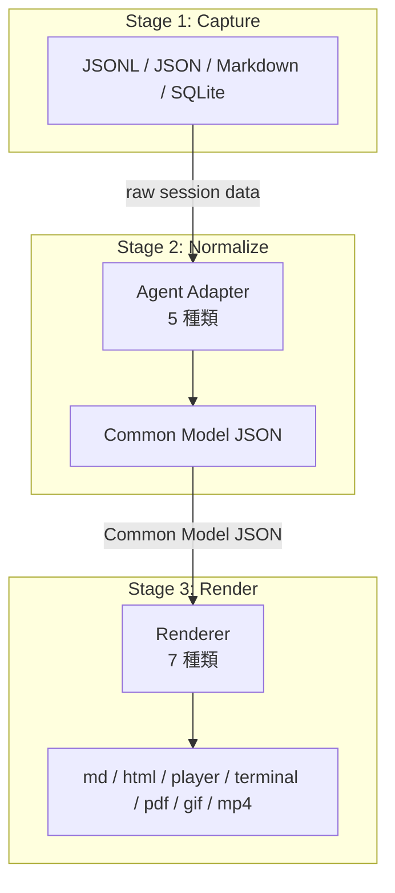
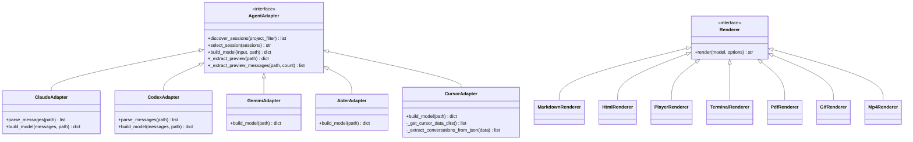
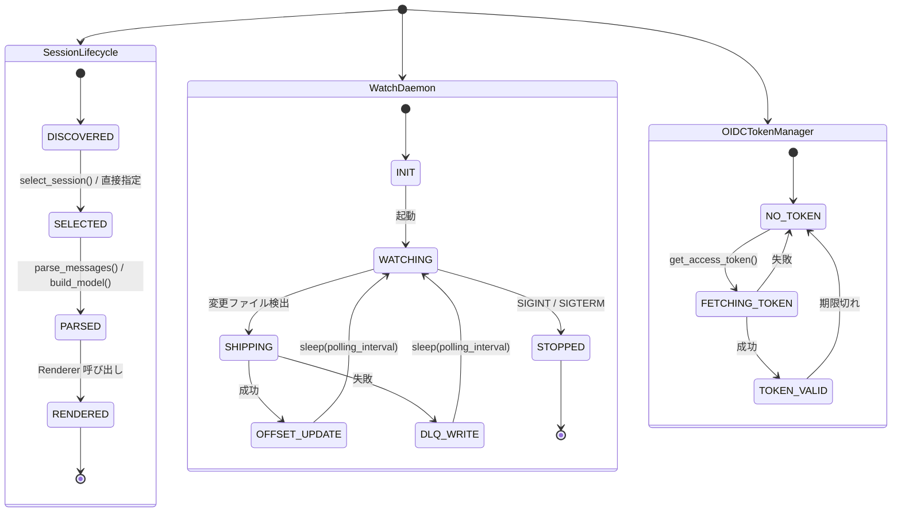
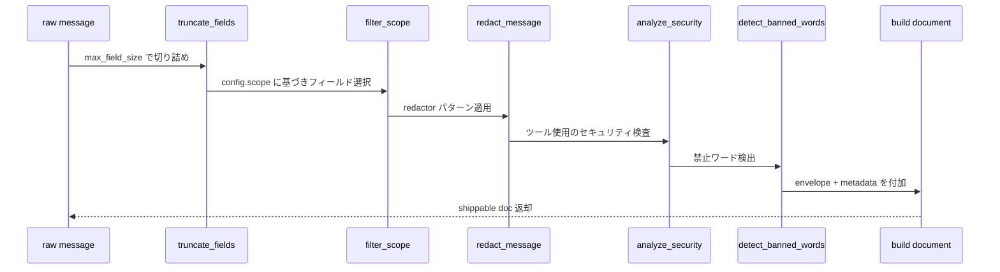

# claude-session-replay — Technical Specification

> Version 1.0.0 · 2026-04-19
>
> This document is the authoritative specification for the `claude-session-replay`
> project. It covers architecture, data contracts, state machines, business logic,
> external APIs, UI design, configuration, dependencies, non-functional requirements,
> test strategy, and deployment/operations. All implementation decisions must be
> traceable to a section here.

---

## Table of Contents

1. [概要 (Overview)](#1-概要-overview)
2. [機能仕様 (Functional Specification)](#2-機能仕様-functional-specification)
3. [データ永続化層 (Data Persistence Layer)](#3-データ永続化層-data-persistence-layer)
4. [ステートマシン (State Machine)](#4-ステートマシン-state-machine)
5. [ビジネスロジック (Business Logic)](#5-ビジネスロジック-business-logic)
6. [API / 外部境界 (API and External Boundaries)](#6-api--外部境界-api-and-external-boundaries)
7. [UI (Web UI and TUI)](#7-ui-web-ui-and-tui)
8. [設定 (Configuration)](#8-設定-configuration)
9. [依存関係 (Dependencies)](#9-依存関係-dependencies)
10. [非機能要件 (Non-Functional Requirements)](#10-非機能要件-non-functional-requirements)
11. [テスト戦略 (Test Strategy)](#11-テスト戦略-test-strategy)
12. [デプロイ / 運用 (Deployment and Operations)](#12-デプロイ--運用-deployment-and-operations)

---

## 1. 概要 (Overview)

### 1.1 プロジェクトの目的

`claude-session-replay` は AI コーディングエージェント（Claude Code、Codex CLI、
Gemini CLI、Aider、Cursor）のセッションログを、人間が読めるリプレイ形式に変換する
ツールチェーンである。

中核的な価値提案は次の三点である。

1. **再現性**: コーディングセッションをあとから正確に追体験できる。
2. **可視化**: テキスト・ツール使用・思考過程を構造化された HTML/TUI で表示する。
3. **シッピング**: 企業環境向けに OpenSearch へのリアルタイム配信が可能。

### 1.2 三段パイプライン

システム全体は **Capture → Normalize → Render** の三段パイプラインで設計される。

```
┌─────────────────────────────────────────────────────────────────┐
│  Stage 1: Capture                                               │
│  各エージェントのネイティブログ形式を読み込む                   │
│  (JSONL / JSON / Markdown / SQLite)                             │
└───────────────────────────┬─────────────────────────────────────┘
                            │ raw session data
                            ▼
┌─────────────────────────────────────────────────────────────────┐
│  Stage 2: Normalize                                             │
│  Agent Adapter が共通モデル (Common Model JSON) に変換する      │
│  5 種類のアダプター                                             │
└───────────────────────────┬─────────────────────────────────────┘
                            │ Common Model JSON
                            ▼
┌─────────────────────────────────────────────────────────────────┐
│  Stage 3: Render                                                │
│  Renderer が出力フォーマットに変換する                          │
│  7 種類のレンダラー                                             │
└─────────────────────────────────────────────────────────────────┘
```



### 1.3 5 種類のエージェントアダプター

| # | アダプター | ソースファイル | ネイティブ形式 | ログ格納場所 |
|---|-----------|---------------|---------------|-------------|
| 1 | claude | `claude-log2model.py` | JSONL (1行1イベント) | `~/.claude/projects/<dir>/*.jsonl` |
| 2 | codex | `codex-log2model.py` | JSONL (message events) | `~/.codex/sessions/**/*.jsonl` |
| 3 | gemini | `gemini-log2model.py` | JSON (会話配列) | `~/.gemini/tmp/<dir>/chats/session-*.json` |
| 4 | aider | `aider-log2model.py` | Markdown (chat history) | `~/.aider/**/*.md`, `**/.aider.chat.history.md` |
| 5 | cursor | `cursor-log2model.py` | SQLite (`state.vscdb`) / JSON | `~/.cursor/`, `~/.config/Cursor/` など |

### 1.4 7 種類のレンダラー

| # | レンダラー | 形式 | 主なユースケース |
|---|-----------|------|----------------|
| 1 | markdown | `.md` | ターミナル / テキスト共有 |
| 2 | html | `.html` | ブラウザ静的ビュー |
| 3 | player | `.html` | インタラクティブ再生プレーヤー |
| 4 | terminal | `.html` | コンソール風ダーク表示 |
| 5 | pdf | `.pdf` | 印刷 / アーカイブ |
| 6 | gif | `.gif` | アニメーション共有 |
| 7 | mp4 | `.mp4` | 動画共有 |



---

## 2. 機能仕様 (Functional Specification)

### 2.1 Capture フェーズ

#### 2.1.1 セッション検出 (Session Discovery)

各アダプターは `discover_sessions(project_filter=None)` 関数を公開する。
戻り値は次のフィールドを持つ辞書のリスト（`mtime` 降順ソート済み）。

```python
{
    "path":    str,   # 絶対ファイルパス
    "project": str,   # プロジェクト名
    "size":    int,   # バイト数
    "mtime":  float,  # Unix タイムスタンプ
}
```

**フィルタリング規則**

- Claude: `~/.claude/projects/` 配下を再帰探索。1 KB 未満のファイルを除外。
  `subagents/` サブディレクトリを除外。
- Codex: `~/.codex/sessions/` 配下を再帰探索。
- Gemini: `~/.gemini/tmp/` 配下を再帰探索。
- Aider: `~/.aider/` 配下および `~/work/`, `~/projects/` など一般的な開発ディレクトリ
  3 層の深さまで `.aider.chat.history.md` を探索。100 バイト未満のファイルを除外。
- Cursor: `_get_cursor_data_dirs()` が返すパス候補をスキャン。
  `state.vscdb`（SQLite）および `chat*.json`, `conversation*.json` などを収集。

#### 2.1.2 セッション選択 (Session Selection)

`select_session(sessions)` 関数は対話的な番号選択メニューを標準出力に表示し、
選択されたパスを文字列で返す。Ctrl+C / EOF で SystemExit(0)。

表示カラム: `#`, `Date`, `Branch`(Claude のみ), `Project`, `Size`, `Msgs`, `First message`

#### 2.1.3 Cursor SQLite 解析

Cursor の `state.vscdb` は VSCode の `ItemTable`（キー・バリューテーブル）を使用する。
キー名に `chat`, `composer`, `conversation`, `aichat` を含む行を JSON としてデコードし、
`_extract_conversations_from_json()` で会話データを抽出する。

`workspaceStorage/<hash>/state.vscdb` も同様に探索する。

### 2.2 Normalize フェーズ

#### 2.2.1 共通モデル (Common Model)

アダプターが出力する共通モデルの JSON スキーマ。

```json
{
  "source": "string (basename of source file)",
  "agent":  "claude | codex | gemini | aider | cursor",
  "messages": [
    {
      "role":         "user | assistant",
      "text":         "string",
      "tool_uses":    [ ToolUse, ... ],
      "tool_results": [ ToolResult, ... ],
      "thinking":     [ "string", ... ],
      "timestamp":    "ISO-8601 | empty string"
    }
  ]
}
```

**ToolUse オブジェクト**

```json
{
  "type":  "tool_use",
  "id":    "string",
  "name":  "string (Read | Write | Edit | Bash | Grep | Glob | Task | ...)",
  "input": { "key": "value", ... }
}
```

**ToolResult オブジェクト**

```json
{
  "content": "string"
}
```

#### 2.2.2 各アダプターのパース規則

**Claude アダプター**

- `type == "user" | "assistant"` の行のみ処理
- `message.content` がリストの場合、ブロック種別で分岐:
  - `type == "text"` → `text` に連結
  - `type == "tool_use"` → `tool_uses` に追加
  - `type == "tool_result"` → `tool_results` に追加
  - `type == "thinking"` → `thinking` に追加
- `text`, `tool_uses`, `tool_results`, `thinking` がすべて空のエントリは除外

**Codex アダプター**

- `type == "message"` の行のみ処理
- `content` の `function_call` → ToolUse、`function_call_output` → ToolResult

**Gemini アダプター**

- `type == "user"` → `role = "user"`、`type == "gemini"` → `role = "assistant"`
- `thoughts[].description` → `thinking` リスト

**Aider アダプター**

- `####` ヘッダーでメッセージ境界を検出する二方式:
  1. `#### /user` / `#### /assistant` を持つ明示的ロールマーカー形式
  2. `#### <text>` = ユーザー、`> ` プレフィックス行 = アシスタント（標準形式）
- `tool_uses`, `tool_results`, `thinking` は常に空リスト

**Cursor アダプター**

- SQLite または JSON から抽出した `conversations` リストをフラットなメッセージ列に変換
- `role == "human"` → `"user"` に正規化

#### 2.2.3 メッセージプレビュー抽出

各アダプターは `_extract_preview(path)` と `_extract_preview_messages(path, count)` を提供し、
セッション選択 UI 向けのメタデータを高速に取得できるようにする。

### 2.3 Render フェーズ

#### 2.3.1 Markdown レンダラー

- ロールヘッダーを `## User` / `## Assistant` で出力
- ToolUse は `format_tool_use()` でフォーマット（Read/Write/Edit/Bash/Grep/Glob/Task など）
- ToolResult は `<details>` タグで折り畳み表示
- Thinking ブロックは `> [思考]` のブロック引用で表示

#### 2.3.2 HTML レンダラー

- テーマ: `light`（デフォルト）または `console`（ダーク）
- すべての CSS/JS を HTML にインライン埋め込み（外部リソース不要）
- ANSI カラーコードを `strip`（除去）または `color`（HTML span 変換）

#### 2.3.3 Player レンダラー

- `<div id="messages-data">` に JSON データを埋め込み
- 再生ボタン・スライダーで 1 メッセージずつ「タイプライター」アニメーション
- フィルター: `thinking`, `tool_use`, `tool_result`, `progress`, `file_history`
- 範囲指定: `--range 1-50,53-` 形式（1 始まり、コンマ区切り）
- テキスト切り詰め: `--truncate` (デフォルト 500 文字、0 = 無制限)

#### 2.3.4 Terminal レンダラー

- コンソール風の HTML 出力（黒背景・緑テキスト）
- ANSI カラーコード対応

#### 2.3.5 PDF レンダラー

`log-replay-pdf.py` が担当。Player HTML を Playwright で開きスクリーンショット列を
PDF 化（`page.pdf()`）。

```
log-replay-pdf.py --agent claude session.jsonl -o out.pdf
```

#### 2.3.6 GIF レンダラー

`log-replay-gif.py` が担当。Player HTML を Playwright でフレームごとにスクリーンショットし、
Pillow で GIF 化（またはFFmpeg で結合）。

```
log-replay-gif.py --agent claude session.jsonl -o out.gif
```

#### 2.3.7 MP4 レンダラー

`log-replay-mp4.py` が担当。Player HTML を Playwright + FFmpeg でスクリーン録画して MP4 出力。

```
log-replay-mp4.py --agent claude session.jsonl -f player -o out.mp4
```

---

## 3. データ永続化層 (Data Persistence Layer)

### 3.1 入力データ形式

#### 3.1.1 JSONL (Claude / Codex)

1 行 1 JSON オブジェクト。UTF-8。改行区切り。

Claude 行の代表フィールド:

```jsonc
{
  "type": "user" | "assistant" | "summary" | ...,
  "message": { "role": "...", "content": [...] },
  "timestamp": "2025-01-01T12:00:00.000Z",
  "gitBranch": "main"
}
```

#### 3.1.2 JSON (Gemini)

単一 JSON ファイル。トップレベルに `messages` 配列。

```jsonc
{
  "messages": [
    {
      "type": "user" | "gemini",
      "content": "string | [{ text: ... }]",
      "timestamp": "...",
      "thoughts": [{ "description": "..." }]
    }
  ]
}
```

#### 3.1.3 Markdown (Aider)

2 形式が存在する。

**形式 A (明示的ロールマーカー)**:

```markdown
#### /user 2025-01-01 12:00:00
ユーザーメッセージ

#### /assistant 2025-01-01 12:00:01
アシスタント応答
```

**形式 B (標準)**:

```markdown
# aider chat started at 2025-01-01 12:00:00

#### ユーザープロンプト
> アシスタント応答行 1
> アシスタント応答行 2
```

#### 3.1.4 SQLite (Cursor)

`state.vscdb` は VSCode が使用する SQLite データベース。

テーブル構造:

```sql
CREATE TABLE ItemTable (
    key   TEXT NOT NULL UNIQUE,
    value BLOB
);
```

`key` に `chat`, `composer`, `conversation`, `aichat` を含む行の `value` を JSON としてパースする。

### 3.2 共通モデル (Common Model)

`*.model.json` として一時ファイルまたは指定パスに保存される。
ステージ間のインターフェースとして機能し、レンダラーはこのファイルのみを消費する。

ファイル命名規則: `<source_basename>.model.json`（デフォルト）

### 3.3 シッパー状態ファイル (Shipper State)

`~/.claude-replay/shipper-state.json`（設定で変更可）

```jsonc
{
  "files": {
    "/abs/path/to/session.jsonl": {
      "byte_offset":  0,
      "line_count":   42,
      "last_mtime":   1700000000.0,
      "last_shipped": "2025-01-01T12:00:00+00:00",
      "session_id":   "abc123def456"
    }
  }
}
```

**byte_offset**: ストリームモードでの読み取り位置（行ベースオフセット）。
**line_count**: バッチモードでの処理済み行数（0 始まり）。
**session_id**: セッションファイル絶対パスの SHA-256 先頭 16 文字。

### 3.4 Dead Letter Queue (DLQ)

`~/.claude-replay/dlq/dlq-<timestamp>-<pid>.ndjson`

配信失敗ドキュメントを NDJSON 形式で書き込む。各行に `_dlq_error` と
`_dlq_timestamp` を付加。

`retry-dlq` サブコマンドで再配信後、成功すれば DLQ ファイルを削除する。

### 3.5 OIDC トークンキャッシュ

`~/.claude-replay/oidc-token.json`

```json
{
  "access_token": "...",
  "token_type":   "Bearer",
  "expires_in":   300,
  "expires_at":   1700000300.0
}
```

有効期限 30 秒前を失効とみなし自動更新する。

---

## 4. ステートマシン (State Machine)

### 4.1 セッションライフサイクル

```
         ┌──────────────────────────────────┐
         │           DISCOVERED             │
         │  discover_sessions() が返した    │
         │  セッションファイルが存在する     │
         └───────────────┬──────────────────┘
                         │ select_session() / 直接指定
                         ▼
         ┌──────────────────────────────────┐
         │            SELECTED              │
         │  入力ファイルパスが確定          │
         └───────────────┬──────────────────┘
                         │ parse_messages() / build_model()
                         ▼
         ┌──────────────────────────────────┐
         │            PARSED                │
         │  Common Model メモリ上に存在     │
         └───────────────┬──────────────────┘
                         │ Renderer 呼び出し
                         ▼
         ┌──────────────────────────────────┐
         │           RENDERED               │
         │  出力ファイルが生成された        │
         └──────────────────────────────────┘
```

### 4.2 シッパーウォッチデーモンのステートマシン

```
         ┌──────────────────────────────────┐
         │             INIT                 │
         │  設定ロード、トランスポート生成  │
         │  オフセットトラッカー初期化      │
         └───────────────┬──────────────────┘
                         │ 起動
                         ▼
         ┌──────────────────────────────────┐
         │           WATCHING               │◄───────────────────┐
         │  FileWatcher.poll() でファイル   │                    │
         │  変更を検出                      │                    │
         └───────────────┬──────────────────┘                    │
                         │ 変更ファイル検出                      │
                         ▼                                       │
         ┌──────────────────────────────────┐                    │
         │           SHIPPING               │                    │
         │  ship_stream_file() 呼び出し     │                    │
         │  バッチ組み立て・Transport.ship  │                    │
         └──────┬─────────────┬─────────────┘                    │
                │ 成功        │ 失敗                             │
                ▼             ▼                                   │
         ┌───────────┐ ┌─────────────────────┐                   │
         │ OFFSET    │ │  DLQ WRITE          │                   │
         │ UPDATE    │ │  リトライ後 DLQ に  │                   │
         │           │ │  書き込み           │                   │
         └─────┬─────┘ └──────────┬──────────┘                   │
               └─────────┬────────┘                               │
                         │ sleep(polling_interval)                │
                         └────────────────────────────────────────┘
                         │ SIGINT / SIGTERM
                         ▼
         ┌──────────────────────────────────┐
         │            STOPPED               │
         └──────────────────────────────────┘
```

### 4.3 OIDCTokenManager のステートマシン

```
  ┌──────────────┐    get_access_token()    ┌─────────────────┐
  │   NO_TOKEN   │─────────────────────────►│  FETCHING_TOKEN │
  │ (初期 or 期限│                           │  _fetch_token() │
  │   切れ)      │◄──────── 失敗 ───────────│                 │
  └──────────────┘                           └────────┬────────┘
                                                      │ 成功
                                                      ▼
                                             ┌─────────────────┐
                                             │  TOKEN_VALID    │
                                             │  expires_at に  │
                                             │  基づきキャッシュ│
                                             └────────┬────────┘
                                                      │ 期限切れ
                                                      └──────────►  NO_TOKEN
```



---

## 5. ビジネスロジック (Business Logic)

### 5.1 エージェントアダプター (Agent Adapters)

各アダプターは以下のインターフェースを実装する。

```python
# 必須
def discover_sessions(project_filter=None) -> list[dict]: ...
def select_session(sessions: list[dict]) -> str: ...         # 対話的選択
def build_model(input_or_data, input_path) -> dict: ...      # Common Model を返す

# 推奨 (シッパー / 統計エンジンから使用)
def _extract_preview(path: str) -> dict: ...
def _extract_preview_messages(path: str, count: int) -> list[dict]: ...
```

Claude と Codex は追加で `parse_messages(path)` を持ち、
`build_model(messages, path)` と分離している。

Gemini と Aider と Cursor は `build_model(path)` のみで完結する。

#### 5.1.1 セッション ID 計算

```python
def _session_id_from_path(path: str) -> str:
    return hashlib.sha256(os.path.abspath(path).encode()).hexdigest()[:16]
```

#### 5.1.2 ドキュメント ID 計算

```python
def _doc_id(session_id: str, message_index: int) -> str:
    raw = f"{session_id}:{message_index}"
    return hashlib.sha256(raw.encode()).hexdigest()[:20]
```

べき等性を保証するため、同一セッションの同一インデックスは常に同じ ID を返す。

### 5.2 レンダラー (Renderers)

#### 5.2.1 メッセージ範囲フィルタ

`parse_range_spec(spec, total)` は `"1-50,53-"` 形式の文字列を 0 始まりインデックスリストに変換する。

```python
"1-3"   → [0, 1, 2]
"2-"    → [1, 2, ..., total-1]
"-3"    → [0, 1, 2]
"1,3,5" → [0, 2, 4]
```

#### 5.2.2 ToolUse フォーマット

`format_tool_use(tool_use)` が各ツール種別を読みやすい Markdown に変換する。

| ツール名 | フォーマット規則 |
|---------|----------------|
| Read | `` **Read**: `<file_path>` `` |
| Write | `` **Write**: `<file_path>` (<N> lines) `` |
| Edit | diff ブロックに old/new 先頭 200 文字を表示 |
| Bash | bash コードブロック |
| Grep | `` **Grep**: `<pattern>` in `<path>` `` |
| Glob | `` **Glob**: `<pattern>` `` |
| Task | description を表示 |
| その他 | `` **<name>** `` |

#### 5.2.3 テキスト切り詰め

`_truncate_text(text, truncate_length)` は `(text, was_truncated)` タプルを返す。
`truncate_length == 0` または `None` の場合は切り詰めなし。

### 5.3 セッションシッパー (Session Shipper)

#### 5.3.1 メッセージ処理パイプライン

`process_message()` は以下の順序で処理する。

```
raw message
    ↓ truncate_fields(max_field_size)
    ↓ filter_scope(config.scope)
    ↓ redact_message(redactor)
    ↓ analyze_security(message, config)
    ↓ detect_banned_words(message, config)
    ↓ build document with envelope + metadata
    → doc (shippable)
```



#### 5.3.2 スコープフィルタ

`filter_scope(message, config)` は設定に応じてフィールドを取捨選択する。

| config フィールド | 対応メッセージフィールド |
|------------------|------------------------|
| `include_text` | `text` |
| `include_thinking` | `thinking` |
| `include_tool_use` | `tool_uses` |
| `include_tool_result` | `tool_results` |

`metadata_only` が有効な場合、テキスト/ツール内容を除外しメタデータのみ送信する。

#### 5.3.3 Redaction エンジン

`build_redactor(config)` は設定の `redaction.patterns` から
`(compiled_regex, replacement)` タプルリストを構築する。

`apply_redaction(text, redactor)` で逐次 `re.sub` 適用。

`redact_message(message, redactor)` は `text`, `thinking`,
`tool_uses[].input` 文字列値, `tool_results[].content` に適用する。

#### 5.3.4 セキュリティ分析

`analyze_security(message, config)` はツール使用を検査し、次のカテゴリのアラートを返す。

| カテゴリ | 重大度 | 検出条件 |
|---------|--------|---------|
| `sensitive_file_read` | high | Read/file_read の path が `sensitive_paths` に含まれる |
| `sensitive_file_write` | high | Write/file_write の path が `sensitive_paths` に含まれる |
| `suspicious_command` | medium | Bash/shell_command の command が `suspicious_commands` に含まれる |
| `external_access` | medium | Bash コマンドに `http://` / `https://` URL が存在 |
| `sensitive_search` | low | Grep の pattern が `sensitive_paths` に含まれる |

#### 5.3.5 Webhook 配信

`send_webhook(config, alerts, doc)` は設定の `webhooks.events` リストに
マッチするアラートが存在する場合に HTTP POST する。

フォーマット:
- `"slack"`: Slack Block Kit 形式
- `"generic"` (デフォルト): JSON イベントオブジェクト

リトライ: `webhooks.max_retries` 回まで。

#### 5.3.6 トランスポート

`Transport.ship(documents)` → `(ok_count, error_count)`

| トランスポート | 用途 |
|--------------|------|
| `OpenSearchTransport` | OpenSearch / Elasticsearch Bulk API |
| `FileExportTransport` | NDJSON ファイル出力 |
| `DryRunTransport` | stdout への pretty-print（テスト用） |

`create_transport(config, dry_run)` がファクトリ。

#### 5.3.7 バッチモード vs ストリームモード

**バッチモード** (`cmd_batch`):
- `parse_messages()` + `build_model()` でセッション全体をパース
- `offset_tracker.get_offset(path)` で既送信数を取得
- 新規メッセージのみをバッチ送信
- 送信後 `offset_tracker.update_offset()` + `save()`

**ストリームモード** (`ship_stream_file`):
- `f.seek(byte_offset)` で前回位置から読み込み
- 1 行ずつパース・送信
- 送信後 `byte_offset = f.tell()` を保存

### 5.4 検索エンジン (Search Engine)

`search_utils.py` が担当。`search_across_sessions(agents, query, options)` を提供。

```python
results, stats = search_utils.search_across_sessions(
    agents=["claude", "codex"],
    query="refactor",
    options={
        "case_sensitive": False,
        "regex": False,
        "max_sessions": 100,
        "max_matches_per_session": 5,
        "scope": ["text", "thinking", "tool_use", "tool_result"],
    }
)
```

`stats` フィールド: `sessions_scanned`, `sessions_matched`, `elapsed_ms`

### 5.5 統計エンジン (Statistics Engine)

`session-stats.py` が担当。

#### 5.5.1 セッション統計

`compute_session_stats(model)` が返すフィールド:

- メッセージ数（user / assistant 別）
- 総文字数・平均文字数
- ツール使用回数・種別カウント
- 思考ブロック数
- セッション開始/終了タイムスタンプ・所要時間
- トップ使用ツール

#### 5.5.2 クロスセッション概要

`compute_overview_stats(agents)` はすべてのセッションを並列スキャン（`ThreadPoolExecutor`）し、
エージェント別・全体のサマリーを集計する。

#### 5.5.3 セッション差分

`compute_diff(model_a, model_b)` は 2 セッションのメッセージ数・ツール使用・
文字数の差分を返す。

---

## 6. API / 外部境界 (API and External Boundaries)

### 6.1 CLI (log-replay.py)

メインエントリポイント。引数なしで起動すると TUI モードを起動する。

```
log-replay.py [OPTIONS] [INPUT]
```

#### 6.1.1 共通オプション

| オプション | デフォルト | 説明 |
|-----------|-----------|------|
| `--agent` | (必須、replay のみ) | `claude \| codex \| gemini \| aider \| cursor` |
| `INPUT` | (省略時は対話選択) | 入力ファイルパス |
| `-o / --output` | 自動生成 | 出力ファイルパス |
| `-f / --format` | `md` | `md \| html \| player \| terminal \| pdf \| gif` |
| `-t / --theme` | `light` | `light \| console` |
| `--model` | 一時ファイル | 中間モデル JSON を保存するパス |
| `--project` | なし | プロジェクト名フィルター |

#### 6.1.2 検索モード

`--search <query>` を指定すると検索モード。

| オプション | 説明 |
|-----------|------|
| `--search-scope` | `text,thinking,tool_use,tool_result` のカンマ区切り |
| `--case-sensitive` | 大文字小文字を区別 |
| `--regex` | 正規表現として扱う |

#### 6.1.3 ストリームモード

`--follow` / `-F` または `--stream` でリアルタイム追従モード。

| オプション | デフォルト | 説明 |
|-----------|-----------|------|
| `--poll-interval` | `500` | ポーリング間隔 (ms) |
| `--format` | `terminal` | `terminal \| markdown` |

#### 6.1.4 統計モード

`--stats` でセッション統計を表示。
`--stats --overview` で全エージェントのクロスセッション概要。
`--diff SESSION_A SESSION_B` でセッション比較。

### 6.2 Web UI (web_ui.py)

Flask アプリ。デフォルト `http://localhost:5000`。

#### 6.2.1 エンドポイント一覧

| メソッド | パス | 説明 |
|---------|------|------|
| GET | `/` | メインページ (index.html) |
| GET | `/api/sessions` | セッション一覧 JSON |
| GET | `/api/session/<id>/preview` | セッションプレビュー JSON |
| GET | `/api/session/<id>/render` | セッションレンダリング HTML |
| POST | `/api/render` | アップロードファイルのレンダリング |
| GET | `/api/stream/<id>` | SSE ストリーム |
| GET | `/output/<filename>` | 生成ファイル配信 |

#### 6.2.2 `/api/sessions` レスポンス

```json
{
  "sessions": [
    {
      "id":      "string (url-safe session identifier)",
      "agent":   "claude | codex | gemini | aider | cursor",
      "project": "string",
      "size":    1234,
      "mtime":   1700000000.0,
      "path":    "/abs/path"
    }
  ]
}
```

#### 6.2.3 最大アップロードサイズ

`app.config['MAX_CONTENT_LENGTH'] = 500 * 1024 * 1024` (500 MB)

### 6.3 TUI (log_replay_tui.py)

Textual フレームワーク使用。`LogReplayApp` クラス。

#### 6.3.1 画面構成

```
┌─ Header ──────────────────────────────────────────────────────┐
│  claude-session-replay                                        │
├─ Body ────────────────────────────────────────────────────────┤
│ ┌─ Agent Filter ──┐ ┌─ Session List ──────────────────────────┤
│ │ ○ All           │ │  #  Date          Project    Msgs  ...  │
│ │ ● Claude        │ │  1  2025-01-01    myproject   42  ...   │
│ │ ○ Codex         │ │  2  2024-12-31    other-proj  18  ...   │
│ │ ○ Gemini        │ │                                         │
│ │ ○ Aider         │ └─────────────────────────────────────────┤
│ │ ○ Cursor        │ ┌─ Preview ───────────────────────────────┤
│ └─────────────────┘ │  User: first message preview...         │
│                     │  Assistant: response preview...         │
│                     └─────────────────────────────────────────┤
├─ Search ──────────────────────────────────────────────────────┤
│  [ Search sessions...                                       ] │
├─ Footer ──────────────────────────────────────────────────────┤
│  q:Quit  Enter:Open  r:Render  s:Stats  /:Search            │
└───────────────────────────────────────────────────────────────┘
```

#### 6.3.2 キーバインディング

| キー | アクション |
|-----|-----------|
| `q` / `Q` | アプリ終了 |
| `Enter` | 選択セッションをブラウザで開く |
| `r` | Player HTML をレンダリングして開く |
| `s` | 統計パネル表示 |
| `/` | 検索フォーカス |
| `Esc` | 検索キャンセル・モーダル閉じる |
| `↑` / `↓` | セッションリスト上下移動 |

#### 6.3.3 ADAPTERS 定数

```python
ADAPTERS = {
    "claude": claude_log2model,
    "codex":  codex_log2model,
    "gemini": gemini_log2model,
    "aider":  aider_log2model,
    "cursor": cursor_log2model,
}
```

### 6.4 Session Shipper CLI (session-shipper.py)

```
session-shipper.py [--config PATH] <subcommand> [OPTIONS]
```

#### 6.4.1 サブコマンド一覧

| サブコマンド | 説明 |
|------------|------|
| `batch` | 完了セッションを一括配信 |
| `watch` | リアルタイムデーモン起動 |
| `lookup` | session_id からローカルファイルを検索 |
| `init-config` | デフォルト設定ファイルを生成 |
| `status` | 配信状態サマリー表示 |
| `retry-dlq` | DLQ エントリを再配信 |
| `policy-sync` | 一回限りのポリシー同期 |
| `decrypt` | 暗号化エクスポートファイルを復号 |
| `validate-config` | 設定検証・接続テスト |

#### 6.4.2 `batch` オプション

| オプション | 説明 |
|-----------|------|
| `--agent` | 特定エージェントのみ処理 |
| `--input` | 特定ファイルを直接指定（複数可） |
| `--dry-run` | パース・表示のみ（送信しない） |

#### 6.4.3 `watch` オプション

| オプション | 説明 |
|-----------|------|
| `--agent` | 監視対象エージェント（複数指定可） |

#### 6.4.4 `lookup` オプション

| オプション | 説明 |
|-----------|------|
| `--session-id` | 検索する session_id (16 文字) |
| `--message` | ジャンプするメッセージインデックス |
| `--open-player` | Player でセッションを開く |

#### 6.4.5 `init-config` オプション

| オプション | 説明 |
|-----------|------|
| `--output` | 出力先パス（デフォルト: `shipper-config.json`） |
| `--force` | 既存ファイルを上書き |
| `--generate-key` | Fernet 暗号化キーを生成 |

#### 6.4.6 `decrypt` オプション

| オプション | 説明 |
|-----------|------|
| `--input` | 暗号化ファイルパス（必須） |
| `--output` | 出力ファイルパス（必須） |
| `--key` | 暗号化キーファイルパス |

### 6.5 外部サービス境界

| サービス | プロトコル | エンドポイント形式 |
|---------|----------|-----------------|
| OpenSearch / Elasticsearch | HTTPS + Bulk API | `<url>/_bulk` |
| OIDC プロバイダー | HTTPS + Client Credentials | `<issuer>/.well-known/openid-configuration` |
| Webhook レシーバー | HTTP(S) POST JSON/Slack | 設定で指定 |
| ポリシーサーバー | HTTPS GET JSON | 設定で指定 |

---

## 7. UI (Web UI and TUI)

### 7.1 Web UI (web_ui.py — 1152 行)

#### 7.1.1 構成

Flask アプリケーション単一ファイル。Jinja2 テンプレートは `templates/index.html`。
静的ファイルなし（すべてテンプレートにインライン）。

#### 7.1.2 セッションディスカバリー

Web UI 起動時と `/api/sessions` リクエスト時に、5 種類すべてのアダプターから
`discover_sessions()` を呼び出してセッション一覧を構築する。

各セッションの `id` は `<agent>:<url_quoted_path>` の Base64 エンコードまたは
連番（実装依存）。

#### 7.1.3 レンダリングフロー

1. クライアントが `/api/session/<id>/render?format=player&theme=light` をリクエスト
2. サーバーが一時ファイルに Common Model を生成
3. `log-model-renderer.py` をサブプロセスで呼び出してレンダリング
4. HTML 文字列をレスポンスとして返却

または直接 Python API 経由でレンダリングする場合もある。

#### 7.1.4 SSE ストリーム

`/api/stream/<id>` は Server-Sent Events でセッションのメッセージを逐次配信する。
フロントエンドはこれを受け取りリアルタイム表示する。

#### 7.1.5 セキュリティ考慮

- パストラバーサル防止: `send_from_directory()` で出力ディレクトリを制限
- アップロードサイズ制限: 500 MB
- ホスト制限: デフォルトは `127.0.0.1` のみバインド

### 7.2 TUI (log_replay_tui.py — 727 行)

#### 7.2.1 Textual ウィジェット構成

```
LogReplayApp (App)
├── Header
├── Horizontal
│   ├── Vertical (left panel, 30%)
│   │   ├── Label "Agent"
│   │   ├── OptionList (agent filter)
│   │   └── Input (search box)
│   └── Vertical (right panel, 70%)
│       ├── ListView (session list)
│       └── VerticalScroll
│           └── Static (preview panel)
└── Footer
```

#### 7.2.2 アダプターロード

TUI 起動時に `_import_module()` で 5 アダプターを動的ロード。
モジュール名衝突を避けるためファイルパスで直接ロードする。

#### 7.2.3 Worker パターン

セッション一覧のロードと Common Model の生成は `@work` デコレーターを使い
バックグラウンドスレッドで実行する（UI のブロッキング防止）。

#### 7.2.4 モーダル画面

統計表示・レンダリング出力確認は `ModalScreen` で実装する。

---

## 8. 設定 (Configuration)

### 8.1 shipper-config.json

Session Shipper の設定ファイル。`DEFAULT_CONFIG` をベースとして
ユーザー設定を `_deep_merge()` で上書きマージする。

探索順: `--config` 指定 → `./shipper-config.json` → `~/.claude-replay/shipper.json`

#### 8.1.1 features セクション

| フラグ | デフォルト | 説明 |
|-------|---------|------|
| `shipping_enabled` | `true` | 配信全体の有効/無効マスタースイッチ |
| `security_analysis` | `true` | セキュリティ分析の有効/無効 |
| `banned_word_detection` | `true` | 禁止ワード検出の有効/無効 |
| `redaction` | `true` | Redaction エンジンの有効/無効 |
| `oidc_auth` | `false` | OIDC 認証の有効/無効 |
| `dls` | `false` | Document Level Security フィールドの付加 |
| `multi_tenant` | `false` | マルチテナントインデックスの有効/無効 |
| `webhooks` | `false` | Webhook 通知の有効/無効 |
| `metadata_only` | `false` | メタデータのみ送信（本文を送信しない） |
| `auto_policy_sync` | `false` | 自動ポリシー同期の有効/無効 |
| `compression` | `false` | gzip 圧縮の有効/無効 |
| `encryption_at_rest` | `false` | ファイルエクスポート暗号化の有効/無効 |
| `dead_letter_queue` | `true` | DLQ の有効/無効 |

#### 8.1.2 endpoint セクション

```jsonc
{
  "endpoint": {
    "type":           "file | opensearch | rest",
    "url":            "https://opensearch.example.com:9200",
    "index":          "agent-sessions",
    "auth": {
      "type":          "none | api_key | basic | oidc",
      "api_key":       "",
      "username":      "",
      "password":      "",
      "issuer_url":    "",
      "client_id":     "",
      "client_secret": "",
      "scopes":        ["openid"],
      "token_cache_path": "~/.claude-replay/oidc-token.json"
    },
    "timeout_seconds": 30,
    "verify_ssl":      true
  }
}
```

#### 8.1.3 identity セクション

```jsonc
{
  "identity": {
    "user_id":      "",   // 空の場合 os.getenv("USER") でフォールバック
    "hostname":     "",   // 空の場合 socket.gethostname() でフォールバック
    "organization": "",
    "roles":        []
  }
}
```

#### 8.1.4 scope セクション

```jsonc
{
  "scope": {
    "include_text":        true,
    "include_thinking":    false,
    "include_tool_use":    true,
    "include_tool_result": false
  }
}
```

#### 8.1.5 redaction セクション

```jsonc
{
  "redaction": {
    "patterns": [
      {
        "name":        "api_key",
        "regex":       "(?i)(api[_-]?key|token|secret)\\s*[:=]\\s*['\"]?([A-Za-z0-9_\\-]{20,})",
        "replacement": "$1=***REDACTED***"
      },
      {
        "name":        "email",
        "regex":       "[a-zA-Z0-9._%+-]+@[a-zA-Z0-9.-]+\\.[a-zA-Z]{2,}",
        "replacement": "***EMAIL***"
      }
    ]
  }
}
```

#### 8.1.6 security セクション

```jsonc
{
  "security": {
    "sensitive_paths":     ["/etc/shadow", "/etc/passwd", ".env", "credentials", "id_rsa", ".ssh/"],
    "suspicious_commands": ["curl ", "wget ", "nc ", "ncat ", "base64 ", "eval "],
    "banned_words":        []
  }
}
```

#### 8.1.7 shipping セクション

```jsonc
{
  "shipping": {
    "batch_size":             50,
    "flush_interval_seconds": 5,
    "max_retries":            3,
    "retry_backoff_seconds":  2,
    "max_field_size":         10240
  }
}
```

`max_field_size` を超えるフィールドは `...[truncated]` を末尾に付加して切り詰める。

#### 8.1.8 multi_tenant セクション

```jsonc
{
  "multi_tenant": {
    "strategy":     "index_per_tenant",
    "index_prefix": "agent-sessions"
  }
}
```

`strategy == "index_per_tenant"` の場合、OpenSearch インデックス名は
`<index_prefix>-<organization>` となる。

### 8.2 .gitignore 対応

`shipper-config.json` はデフォルトで `.gitignore` に追加済み（リポジトリには
`shipper-config.example.json` を代わりに含める）。

認証情報やホスト名情報を含む可能性があるため、`shipper-config.json` および
`~/.claude-replay/` 配下のファイルは vcs 管理しないことを推奨する。

### 8.3 pyproject.toml

```toml
[project]
name = "claude-session-replay"
version = "0.1.0"
requires-python = ">=3.9"

[project.optional-dependencies]
web    = ["flask>=2.0"]
export = ["playwright>=1.0", "Pillow>=9.0"]
all    = ["flask>=2.0", "playwright>=1.0", "Pillow>=9.0"]

[project.scripts]
claude-session-replay = "log_replay:main"
```

---

## 9. 依存関係 (Dependencies)

### 9.1 Python バージョン

**最小要件: Python 3.9+**

CLAUDE.md 記載の "Python 3.6+" は歴史的記述であり、
`pyproject.toml` が `>=3.9` を要求するため 3.9 以上を要件とする。

型ヒントは簡易なものに留め、3.9 互換の構文を使用する。

### 9.2 標準ライブラリ（コア機能）

コア機能はすべて標準ライブラリのみで動作する。pip install 不要。

| モジュール | 用途 |
|-----------|------|
| `argparse` | CLI 引数解析 |
| `base64` | OIDC JWT デコード / Basic 認証 |
| `collections` | `Counter`, `defaultdict` (統計) |
| `concurrent.futures` | 統計並列収集 |
| `copy` | `deepcopy` (redaction) |
| `datetime` | タイムスタンプ処理 |
| `getpass` | ユーザー名フォールバック |
| `gzip` | 圧縮機能 |
| `hashlib` | セッション ID / ドキュメント ID |
| `html` | HTML エスケープ |
| `importlib.util` | 動的モジュールロード |
| `json` | JSON 入出力 |
| `logging` | ログ出力 |
| `os`, `pathlib` | ファイルシステム |
| `platform` | OS 情報 |
| `re` | 正規表現（redaction, 検索） |
| `signal` | シグナルハンドリング |
| `socket` | ホスト名取得 |
| `sqlite3` | Cursor アダプター |
| `ssl` | SSL 検証スキップ |
| `sys` | 標準入出力 |
| `tempfile` | 中間モデルファイル |
| `time` | ポーリング待機 |
| `urllib.request`, `urllib.error`, `urllib.parse` | HTTP 通信 |

### 9.3 オプション依存関係

| パッケージ | インストール方法 | 用途 |
|-----------|---------------|------|
| `flask>=2.0` | `pip install flask` | Web UI |
| `playwright>=1.0` | `pip install playwright && python -m playwright install` | PDF / GIF / MP4 出力 |
| `Pillow>=9.0` | `pip install Pillow` | GIF アニメーション生成 |
| `cryptography` | `pip install cryptography` | Fernet 暗号化（encryption_at_rest 機能） |
| `textual` | `pip install textual` | TUI |
| `ffmpeg` | システムパッケージ（バイナリ） | MP4 / GIF（FFmpeg バックエンド） |

### 9.4 依存関係がない設計上の理由

パッケージマネージャー不要のゼロセットアップを実現するため、コア機能は
標準ライブラリのみで完結させている。オプション機能は実行時に `ImportError` を
キャッチし、インストール方法を案内するメッセージを表示する設計とする。

---

## 10. 非機能要件 (Non-Functional Requirements)

### 10.1 Redaction（機密情報除去）

**要件**: セッション内容を OpenSearch に送信する前に、設定で指定したパターンに
マッチする文字列を置換する。

**適用範囲**:
- `message.text`
- `message.thinking` の各要素
- `tool_uses[].input` の文字列値
- `tool_results[].content`

**デフォルトパターン**:
- API キー / トークン / シークレット（正規表現）
- メールアドレス（正規表現）

**ユーザー定義パターン**: `redaction.patterns` に任意の正規表現を追加可能。

### 10.2 マシン名漏洩防止

**要件**: ローカルホスト名や OS ユーザー名が無断で外部に送信されないよう
設定で制御できなければならない。

**実装**:
- `identity.hostname` を空文字列に設定することでホスト名送信を抑制
- `identity.user_id` を空文字列に設定することで OS ユーザー名送信を抑制
- `metadata_only` フラグを有効にすることでセッション本文を一切送信しない

**oidc_auth 有効時**:
- `user_id` は OIDC トークンの `preferred_username` / `sub` クレームで上書き
- ローカル OS ユーザー名は使用しない

### 10.3 パフォーマンス

| 指標 | 目標値 |
|------|-------|
| Common Model 生成（10 MB JSONL） | < 3 秒 |
| Player HTML 生成（500 メッセージ） | < 2 秒 |
| 検索（100 セッション） | < 10 秒 |
| ストリームポーリング遅延 | < polling_interval + 100 ms |

並列処理: `compute_overview_stats()` は `ThreadPoolExecutor` で
セッションを並列スキャンする。

### 10.4 セルフコンテインド HTML 出力

Player / HTML / Terminal 出力は外部リソース（CDN、フォント、画像）を一切参照しない。
すべての CSS と JavaScript をインラインで埋め込む。

### 10.5 ファイル命名規則

- スクリプトファイル名はハイフン区切り (`claude-log2model.py`)
- Python モジュール内部はアンダースコア区切り（通常の Python 慣習）
- テスト: `tests/test_*.py`

### 10.6 後方互換性

Common Model スキーマのフィールド追加はマイナーバージョンアップとする。
フィールド削除または型変更はメジャーバージョンアップとする。

レンダラーは `model.get("field", default)` パターンで未知フィールドを
無視する設計とする（前方互換性）。

### 10.7 エラーハンドリング

- ファイル読み込みエラー: `except (OSError, UnicodeDecodeError)` でキャッチし
  空リスト / 空文字列を返す（クラッシュしない）
- JSON パースエラー: `except json.JSONDecodeError` でスキップ
- SQLite エラー: `except sqlite3.Error` でスキップし空リストを返す
- ネットワークエラー: `except (urllib.error.URLError, OSError)` でリトライ

### 10.8 ログ出力

Session Shipper は `logging` モジュールを使用。
フォーマット: `HH:MM:SS [LEVEL] message`

DEBUG 出力（`log-model-renderer.py` の `_truncate_text` に残留している
`print(f"DEBUG: ...")` 呼び出し）は本番コードから除去すること（Known Bug）。

---

## 11. テスト戦略 (Test Strategy)

### 11.1 テストフレームワーク

`pyproject.toml` にて `pytest` を開発依存として定義。

```toml
[tool.pytest.ini_options]
testpaths = ["tests"]
python_files = ["test_*.py"]
python_classes = ["Test*"]
python_functions = ["test_*"]
```

### 11.2 テストディレクトリ構成

```
tests/
├── fixtures/
│   ├── claude_session.jsonl      # Claude JSONL サンプル
│   ├── codex_session.jsonl       # Codex JSONL サンプル
│   ├── gemini_session.json       # Gemini JSON サンプル
│   ├── aider_history.md          # Aider Markdown サンプル
│   └── cursor_state.json         # Cursor JSON サンプル
├── test_claude_adapter.py
├── test_codex_adapter.py
├── test_gemini_adapter.py
├── test_aider_adapter.py
├── test_cursor_adapter.py
├── test_renderer.py
├── test_search.py
├── test_shipper.py
└── test_common_model.py
```

### 11.3 ユニットテスト

#### 11.3.1 アダプターテスト

各アダプターについて以下を検証する。

- `parse_messages()` / `build_model()` が有効な Common Model を返す
- `discover_sessions()` がホームディレクトリ不在時に空リストを返す
- `_extract_preview()` がゼロメッセージセッションを正しく処理する
- Unicode / 特殊文字を含むメッセージが文字化けしない
- ファイルが存在しない / 壊れた JSON の場合にクラッシュしない

#### 11.3.2 レンダラーテスト

- `format_tool_use()` が各ツール種別で正しいフォーマットを返す
- `parse_range_spec()` が各入力形式（単一・範囲・開放端）で正しいインデックスを返す
- `filter_messages_by_range()` が空範囲指定で全メッセージを返す
- Markdown 出力にすべてのロールヘッダーが含まれる
- Player HTML が有効な JSON データブロックを含む

#### 11.3.3 Shipper テスト

- `build_redactor()` が無効な正規表現パターンをスキップする
- `apply_redaction()` がメールアドレスパターンを正しく置換する
- `analyze_security()` が sensitive_paths マッチを high として返す
- `filter_scope()` が `metadata_only` モードでテキストフィールドを除外する
- `_doc_id()` がべき等性を持つ（同一入力で同一出力）
- `OffsetTracker` が保存・ロードで状態を維持する

### 11.4 統合テスト

- エンドツーエンド: フィクスチャ JSONL → Common Model → Player HTML の変換
- Shipper バッチ: フィクスチャセッション → DryRunTransport で出力検証
- 検索: フィクスチャセッションに対して検索クエリが正しい結果を返す

### 11.5 スモークテスト

CI では以下を実行する。

```bash
# Common Model 生成
python3 claude-log2model.py tests/fixtures/claude_session.jsonl -o /tmp/test.model.json

# Player HTML レンダリング
python3 log-model-renderer.py /tmp/test.model.json -f player -o /tmp/test.html

# HTML ファイルサイズ確認（0 より大きいこと）
test -s /tmp/test.html
```

### 11.6 手動テスト手順

Web UI の動作確認:

```bash
python3 web_ui.py
# ブラウザで http://localhost:5000 を開く
# セッション選択 → Player レンダリング → 再生動作を確認
```

TUI の動作確認:

```bash
python3 log-replay.py
# ↑↓ でセッション選択
# Enter で Player を開く
```

---

## 12. デプロイ / 運用 (Deployment and Operations)

### 12.1 インストール

#### 12.1.1 基本インストール（コア機能のみ）

```bash
git clone https://github.com/opaopa6969/claude-session-replay.git
cd claude-session-replay
# pip install 不要 — 標準ライブラリのみ
python3 log-replay.py --agent claude
```

#### 12.1.2 pip install -e（開発モード）

```bash
pip install -e .                    # コア + pyproject.toml scripts
pip install -e ".[web]"             # + Web UI (Flask)
pip install -e ".[export]"          # + PDF/GIF/MP4 (Playwright, Pillow)
pip install -e ".[all]"             # すべてのオプション
```

`pip install -e .` 後は `claude-session-replay` コマンドが使用可能になる。

#### 12.1.3 venv 推奨セットアップ

```bash
python3 -m venv .venv
source .venv/bin/activate
pip install -e ".[all]"
python3 -m playwright install
```

### 12.2 Web UI の起動

#### 12.2.1 開発モード

```bash
python3 web_ui.py
# → http://localhost:5000
```

#### 12.2.2 run-web.sh

```bash
./run-web.sh
```

スクリプトは venv のアクティベートと Flask 起動を行う。

#### 12.2.3 本番デプロイ（参考）

Flask の開発サーバーは本番環境には不向き。Gunicorn / uWSGI + Nginx での
リバースプロキシ構成を推奨する。

```bash
pip install gunicorn
gunicorn -w 4 -b 127.0.0.1:5000 web_ui:app
```

### 12.3 Session Shipper の運用

#### 12.3.1 初回設定

```bash
python3 session-shipper.py init-config --output shipper-config.json
# shipper-config.json を編集して endpoint.url / auth を設定
python3 session-shipper.py validate-config  # 設定検証
```

#### 12.3.2 バッチ実行

```bash
# すべてのエージェントのすべてのセッションを処理
python3 session-shipper.py batch

# 特定エージェントのみ
python3 session-shipper.py batch --agent claude

# 特定ファイルのみ（ドライラン）
python3 session-shipper.py batch --input session.jsonl --dry-run
```

#### 12.3.3 ウォッチデーモンの起動

```bash
python3 session-shipper.py watch
# SIGINT (Ctrl+C) または SIGTERM でグレースフルシャットダウン
```

systemd サービスとして登録する場合:

```ini
# /etc/systemd/system/claude-session-shipper.service
[Unit]
Description=Claude Session Shipper

[Service]
ExecStart=/path/to/.venv/bin/python3 /path/to/session-shipper.py watch
WorkingDirectory=/path/to/claude-session-replay
Restart=on-failure

[Install]
WantedBy=multi-user.target
```

#### 12.3.4 DLQ の監視と再配信

```bash
# DLQ の状態確認
python3 session-shipper.py status

# DLQ を再配信
python3 session-shipper.py retry-dlq
```

#### 12.3.5 ポリシー同期

```bash
# 手動ポリシー同期
python3 session-shipper.py policy-sync

# 自動同期はデーモン内で policy_sync.interval_seconds ごとに実行
```

### 12.4 ログ管理

Session Shipper のログは標準出力に出力される（`logging.basicConfig`）。
systemd 環境では `journalctl -u claude-session-shipper -f` で追跡可能。

ログレベルをデバッグに変更する場合:

```python
logging.getLogger("shipper").setLevel(logging.DEBUG)
```

### 12.5 暗号化エクスポートの運用

```bash
# 暗号化キーの生成
python3 session-shipper.py init-config --generate-key

# 暗号化済みエクスポートの復号
python3 session-shipper.py decrypt \
    --input shipped-sessions/ship-20250101-120000-1234.ndjson.gz.enc \
    --output decrypted.ndjson

# キーファイルは~/.claude-replay/encryption.key に保存
# バックアップを必ず取ること
```

### 12.6 バージョン管理と変更履歴

- `pyproject.toml` の `version` フィールドをバージョンの正式ソースとする
- 変更履歴は `CHANGELOG.md` に記録する
- セマンティックバージョニング (`MAJOR.MINOR.PATCH`) を採用する

---

## Appendix A: ファイルマップ

| ファイル | 役割 | 行数 |
|---------|------|------|
| `log-replay.py` | CLI ラッパー（パイプラインオーケストレーター） | ~318 |
| `claude-log2model.py` | Claude アダプター | ~333 |
| `codex-log2model.py` | Codex アダプター | ~397 |
| `gemini-log2model.py` | Gemini アダプター | ~223 |
| `aider-log2model.py` | Aider アダプター | ~446 |
| `cursor-log2model.py` | Cursor アダプター | ~452 |
| `log-model-renderer.py` | レンダラー全種 | ~2835 |
| `log-replay-stream.py` | ストリーム追従モード | ~547 |
| `log-replay-mp4.py` | MP4 エクスポート | ~160 |
| `log-replay-pdf.py` | PDF エクスポート | ~142 |
| `log-replay-gif.py` | GIF エクスポート | ~248 |
| `web_ui.py` | Flask Web UI | ~1152 |
| `log_replay_tui.py` | Textual TUI | ~727 |
| `session-shipper.py` | Session Shipper | ~1596 |
| `session-stats.py` | 統計・差分エンジン | ~668 |
| `search_utils.py` | クロスセッション検索 | ~322 |
| `claude-session-replay.py` | レガシー単体スクリプト（非推奨） | ~2162 |
| `templates/index.html` | Web UI テンプレート | large |
| `tui/` | TUI 追加アセット | varies |
| `pyproject.toml` | ビルド設定 | ~30 |
| `shipper-config.example.json` | 設定テンプレート | ~105 |

---

## Appendix B: 既知の問題 (Known Issues)

1. **DEBUG ログ残留**: `log-model-renderer.py` の `_truncate_text()` 関数に
   `print(f"DEBUG: ...")` 呼び出しが残留している。本番利用前に除去が必要。

2. **shipper-config.json の機械名漏洩**: `identity.hostname` のデフォルト動作は
   `socket.gethostname()` を使用するため、設定ファイルで明示的に制御しないと
   ホスト名が OpenSearch に送信される。非機能要件 10.2 を参照。

3. **Aider assistant_count**: `_extract_preview()` の assistant カウントが
   不完全（ブロック境界検出がヒューリスティック）。

4. **Cursor セッション**: Cursor の内部データ形式はバージョンごとに変化するため、
   新バージョンで `state.vscdb` スキーマが変更された場合にアダプターの更新が必要。

---

## Appendix C: 今後のロードマップ

- **Cursor アダプター強化**: SQLite キースキャンの精度向上、ワークスペースごとの
  会話分離
- **Shipper の aider / cursor 対応**: 現在ストリームモードは claude / codex のみ対応
- **gRPC エンドポイント対応**: OpenSearch 以外のストリーム入力サービスへの対応
- **セッションタグ付け**: ユーザー定義タグを Common Model に追加
- **差分ビューワー**: Web UI 上でのセッション並列表示

---

*End of Specification*
